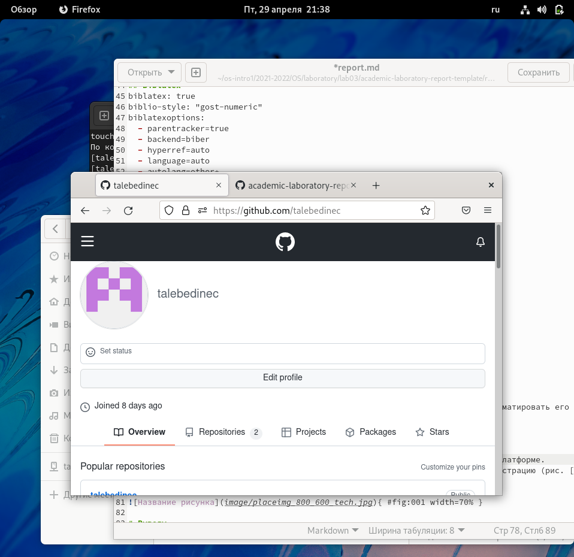
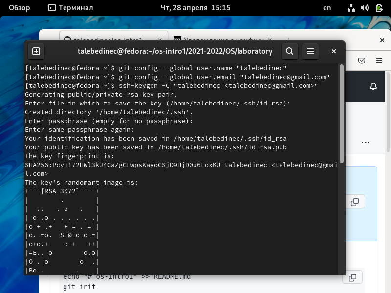
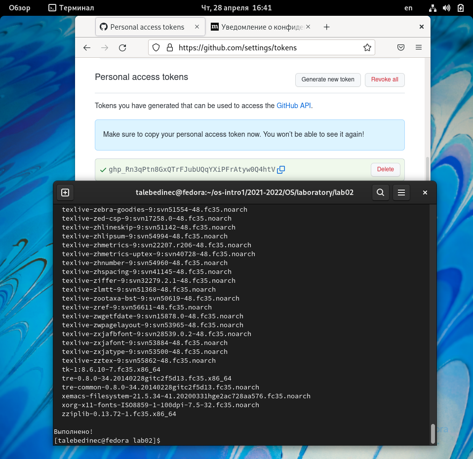
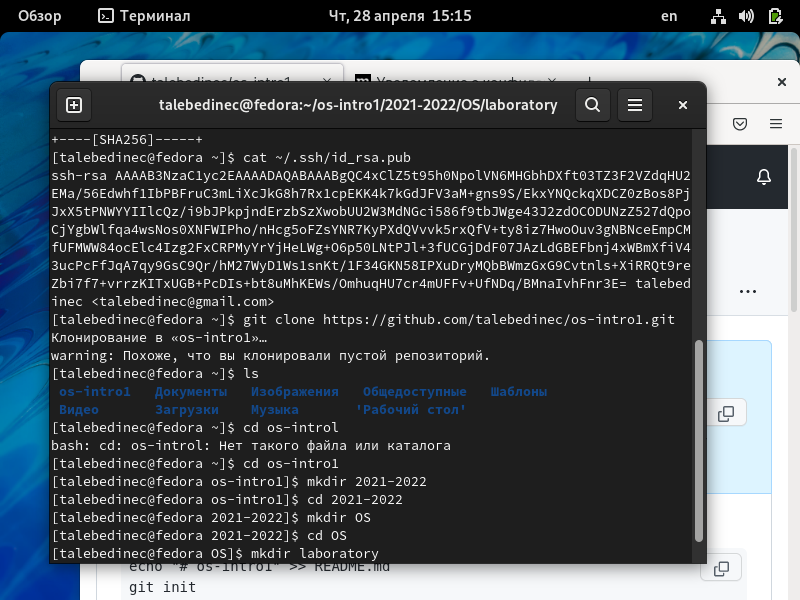

---
## Front matter
title: "Отчёта по лабораторной работе №3"
subtitle: "Дисциплина: Операционные системы "
author: "Татьяна Александровна"

## Generic otions
lang: ru-RU
toc-title: "Содержание"

## Bibliography
bibliography: bib/cite.bib
csl: pandoc/csl/gost-r-7-0-5-2008-numeric.csl

## Pdf output format
toc: true # Table of contents
toc-depth: 2
lof: true # List of figures
lot: true # List of tables
fontsize: 12pt
linestretch: 1.5
papersize: a4
documentclass: scrreprt
## I18n polyglossia
polyglossia-lang:
  name: russian
  options:
	- spelling=modern
	- babelshorthands=true
polyglossia-otherlangs:
  name: english
## I18n babel
babel-lang: russian
babel-otherlangs: english
## Fonts
mainfont: PT Serif
romanfont: PT Serif
sansfont: PT Sans
monofont: PT Mono
mainfontoptions: Ligatures=TeX
romanfontoptions: Ligatures=TeX
sansfontoptions: Ligatures=TeX,Scale=MatchLowercase
monofontoptions: Scale=MatchLowercase,Scale=0.9
## Biblatex
biblatex: true
biblio-style: "gost-numeric"
biblatexoptions:
  - parentracker=true
  - backend=biber
  - hyperref=auto
  - language=auto
  - autolang=other*
  - citestyle=gost-numeric
## Pandoc-crossref LaTeX customization
figureTitle: "Рис."
tableTitle: "Таблица"
listingTitle: "Листинг"
lofTitle: "Список иллюстраций"
lotTitle: "Список таблиц"
lolTitle: "Листинги"
## Misc options
indent: true
header-includes:
  - \usepackage{indentfirst}
  - \usepackage{float} # keep figures where there are in the text
  - \floatplacement{figure}{H} # keep figures where there are in the text
---

# Цель работы

Научиться работать и оформлять отчеты с помощью Markdown.

# Задание
Создать отчет по прошлой лабораторной работе с помощью Markdown. Далее переформатировать его в документ doc и pdf. 

# Выполнение лабораторной работы
*Шаг 1* Настраиваем GitHub, создаем профиль, заполняем необходимые данные на платформе. (рис. [@fig:001])

 {#fig:001 width=70%}

*Шаг 2* Устанавливаем необходимое программное обеспечение. (рис. [@fig:002])

 {#fig:002 width=70%}

*Шаг 3* Следующий шаг - базовая настройка гит. (рис. [@fig:003])

 {#fig:003 width=70%}

*Шаг 4* создаем ключи ssh. (рис. [@fig:004])

 {#fig:004 width=70%}

# Выводы

Я выполнила отчет с помощью Markdown, научилась им пользоваться.

# Список литературы{.unnumbered}

::: {#refs}
:::
