---
## Front matter
title: "Отчёт по лабораторной работе №4"
subtitle: "Дисциплина: Операционные системы"
author: "Татьяна Александровна Лебединец"

## Generic otions
lang: ru-RU
toc-title: "Содержание"

## Bibliography
bibliography: bib/cite.bib
csl: pandoc/csl/gost-r-7-0-5-2008-numeric.csl

## Pdf output format
toc: true # Table of contents
toc-depth: 2
lof: true # List of figures
lot: true # List of tables
fontsize: 12pt
linestretch: 1.5
papersize: a4
documentclass: scrreprt
## I18n polyglossia
polyglossia-lang:
  name: russian
  options:
	- spelling=modern
	- babelshorthands=true
polyglossia-otherlangs:
  name: english
## I18n babel
babel-lang: russian
babel-otherlangs: english
## Fonts
mainfont: PT Serif
romanfont: PT Serif
sansfont: PT Sans
monofont: PT Mono
mainfontoptions: Ligatures=TeX
romanfontoptions: Ligatures=TeX
sansfontoptions: Ligatures=TeX,Scale=MatchLowercase
monofontoptions: Scale=MatchLowercase,Scale=0.9
## Biblatex
biblatex: true
biblio-style: "gost-numeric"
biblatexoptions:
  - parentracker=true
  - backend=biber
  - hyperref=auto
  - language=auto
  - autolang=other*
  - citestyle=gost-numeric
## Pandoc-crossref LaTeX customization
figureTitle: "Рис."
tableTitle: "Таблица"
listingTitle: "Листинг"
lofTitle: "Список иллюстраций"
lotTitle: "Список таблиц"
lolTitle: "Листинги"
## Misc options
indent: true
header-includes:
  - \usepackage{indentfirst}
  - \usepackage{float} # keep figures where there are in the text
  - \floatplacement{figure}{H} # keep figures where there are in the text
---

# Цель работы

Научиться взаимодействовать с системой с помощью командной строки(терминала).

# Задание

Проверить работу команд, представленных в методичке.

# Выполнение лабораторной работы

***Шаг 1***
Определяем полное имя нашего домашнего каталога (рис. [@fig:002])
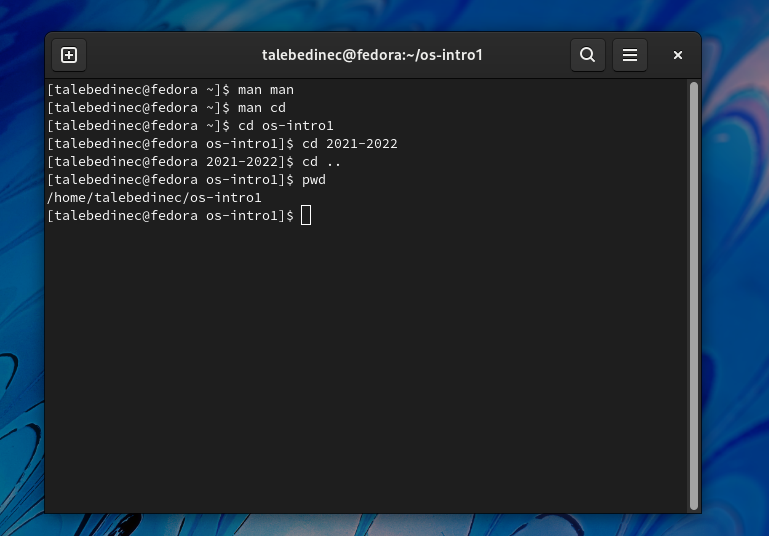 {#fig:002 width=70%}

***Шаг 2*** 
Перейдем в каталог tmp, далее выведем его содержимое на экран с помощью команды ls. (рис. [@fig:008])
С помощью команд cd и ls определим, есть ли в каталоге /var/spool подкаталог cron. Спойлер - нет. Переходим в домашний каталог с помощью команды cd ../.. (рис. [@fig:007])

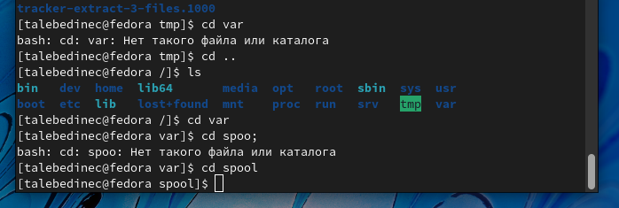 {#fig:007 width=70%}

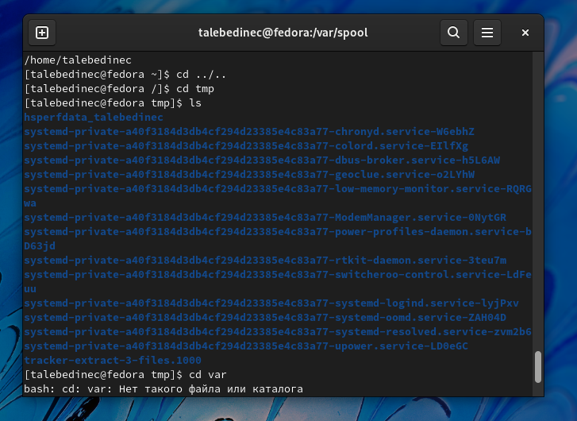 {#fig:008 width=70%}

***Шаг 3***
В домашнем каталоге создаем каталог newdir. В нем создаем еще один - morefun. Далее одной командой за раз сосдадим целых три каталога - letters, memo и misk. Далее так же одной командой удалим их. Командой rm удалить каталог newdir не удалось, зато потом с помощью команды на рисунке это удалось. (рис. [@fig:010])

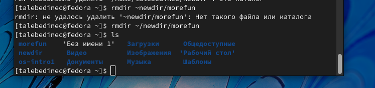 {#fig:010 width=70%}

***Шаг 4***
Используя команду man, определим возможные опции команды ls, и узнаем, какая подходит для того, чтобы просмотреть все содержимое каталога и его подктаталогов; а далее и ту, с помощью которой терминал отсортирует для нас все файлы и каталоги по дате и времени их изменения. (рис. [@fig:011]) (рис. [@fig:012])

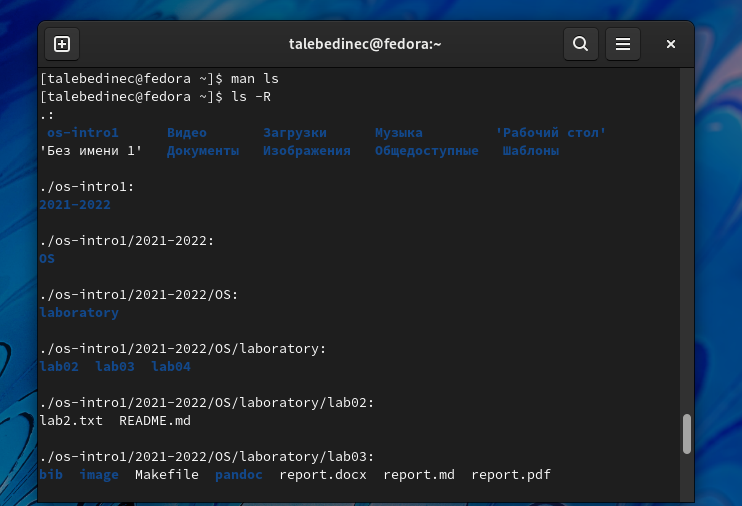 {#fig:011 width=70%}

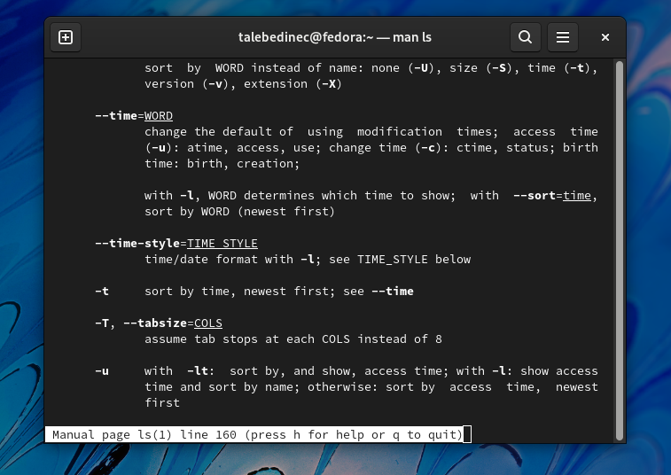 {#fig:012 width=70%}

***Шаг 5*** 
Сейчас нам снова понадобится команда man. С ее помощью проверяем описание команд: 
1. cd (рис. [@fig:013])
2. pwd (рис. [@fig:014])
3. mkdir (рис. [@fig:015])
4. rmdir (рис. [@fig:016])
5. rm (рис. [@fig:017])

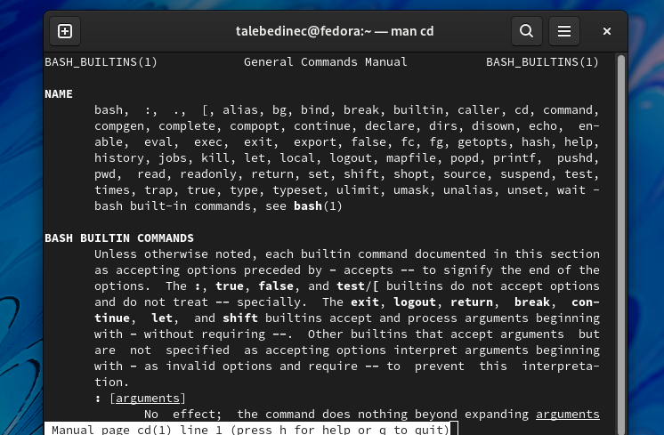 {#fig:013 width=70%}

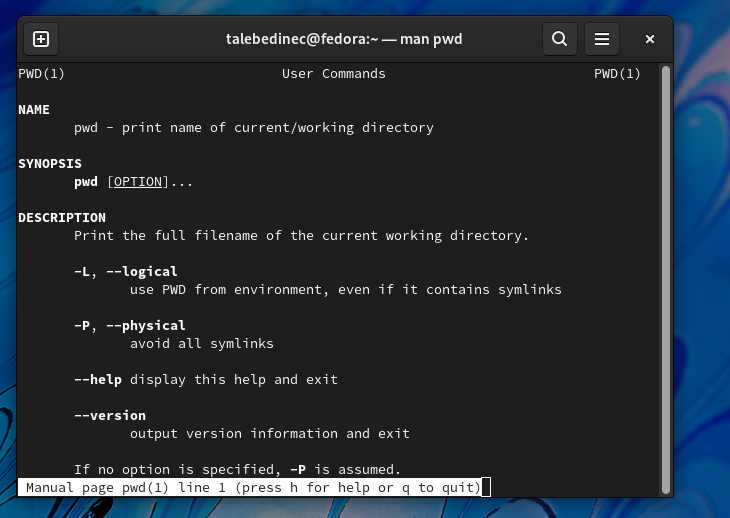 {#fig:014 width=70%}

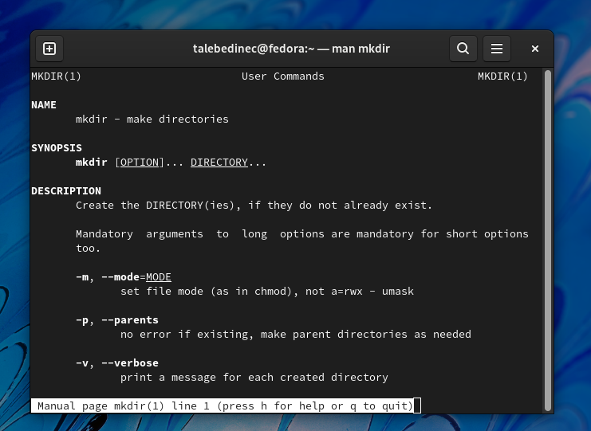 {#fig:015 width=70%}

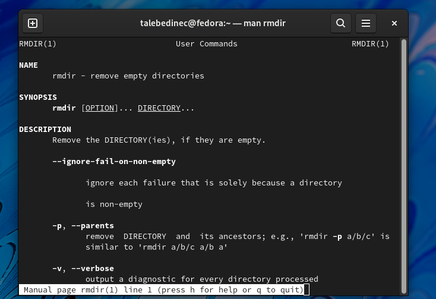 {#fig:016 width=70%}

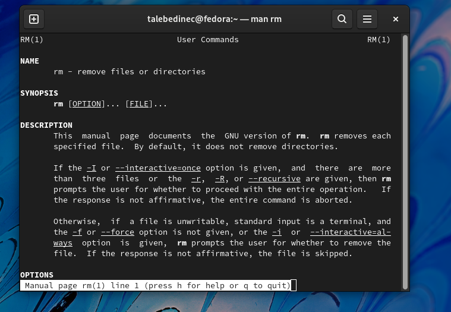 {#fig:017 width=70%}

***Шаг 6***
Введем команду history. Она выводит на экран все команды, которые ранее использовались в нашем терминале. Далее с помощью известных комбинаций выполним модификацию и исполнение команд из буфера команд. (рис. [@fig:006])

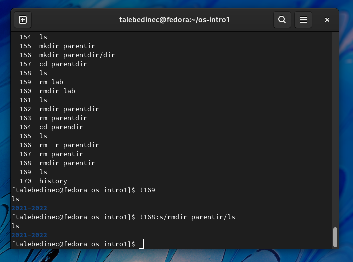 {#fig:006 width=70%}

# Выводы

Я научилась использовать различные команды в терминале, с помощью которых можно создавать, удалять каталоги, передвигаться по ним, а также познакомилась с теми командами, которые выводят на экран историю использования других команд и позволяют более подробно их изучить.

# Список литературы{.unnumbered}

::: {#refs}
:::
