---
## Front matter
title: "Отчёт по лабораторной работе №5"
subtitle: "Дисциплина: Операционные системы"
author: "Татьяна Александровна Лебединец"

## Generic otions
lang: ru-RU
toc-title: "Содержание"

## Bibliography
bibliography: bib/cite.bib
csl: pandoc/csl/gost-r-7-0-5-2008-numeric.csl

## Pdf output format
toc: true # Table of contents
toc-depth: 2
lof: true # List of figures
lot: true # List of tables
fontsize: 12pt
linestretch: 1.5
papersize: a4
documentclass: scrreprt
## I18n polyglossia
polyglossia-lang:
  name: russian
  options:
	- spelling=modern
	- babelshorthands=true
polyglossia-otherlangs:
  name: english
## I18n babel
babel-lang: russian
babel-otherlangs: english
## Fonts
mainfont: PT Serif
romanfont: PT Serif
sansfont: PT Sans
monofont: PT Mono
mainfontoptions: Ligatures=TeX
romanfontoptions: Ligatures=TeX
sansfontoptions: Ligatures=TeX,Scale=MatchLowercase
monofontoptions: Scale=MatchLowercase,Scale=0.9
## Biblatex
biblatex: true
biblio-style: "gost-numeric"
biblatexoptions:
  - parentracker=true
  - backend=biber
  - hyperref=auto
  - language=auto
  - autolang=other*
  - citestyle=gost-numeric
## Pandoc-crossref LaTeX customization
figureTitle: "Рис."
tableTitle: "Таблица"
listingTitle: "Листинг"
lofTitle: "Список иллюстраций"
lotTitle: "Список таблиц"
lolTitle: "Листинги"
## Misc options
indent: true
header-includes:
  - \usepackage{indentfirst}
  - \usepackage{float} # keep figures where there are in the text
  - \floatplacement{figure}{H} # keep figures where there are in the text
---

# Цель работы

Ознакомление с файловой системой Linux, её структурой, именами и содержанием
каталогов. Приобретение практических навыков по применению команд для работы
с файлами и каталогами,по управлению процессами (и работами),по проверке исполь-
зования диска и обслуживанию файловой системы

# Задание

Проверить работу команд, представленных в методичке.

# Выполнение лабораторной работы

***Шаг 1***
Выполним все примеры, представленные в первой части описания лр. (рис. [@fig:001]) (рис. [@fig:002]) (рис. [@fig:003]) (рис. [@fig:004]) (рис. [@fig:005]) (рис. [@fig:006]) (рис. [@fig:007]) (рис. [@fig:008]) (рис. [@fig:009]) (рис. [@fig:010]) (рис. [@fig:011])
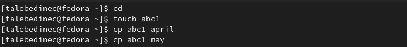 {#fig:001 width=70%}

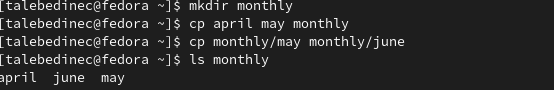 {#fig:002 width=70%}

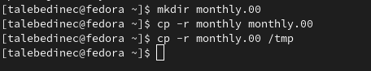 {#fig:003 width=70%}

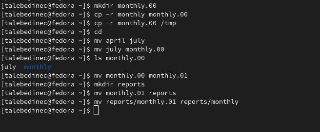 {#fig:004 width=70%}

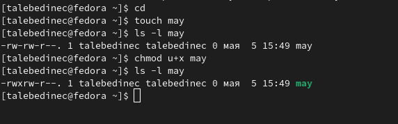 {#fig:005 width=70%}

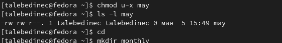 {#fig:006 width=70%}

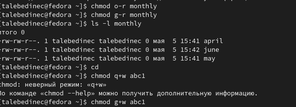 {#fig:007 width=70%}

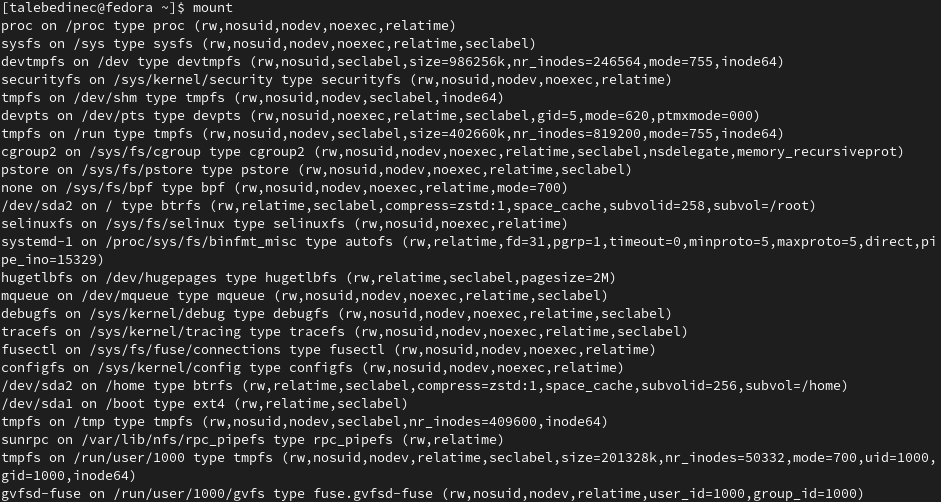 {#fig:008 width=70%}

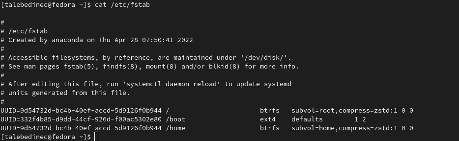 {#fig:009 width=70%}

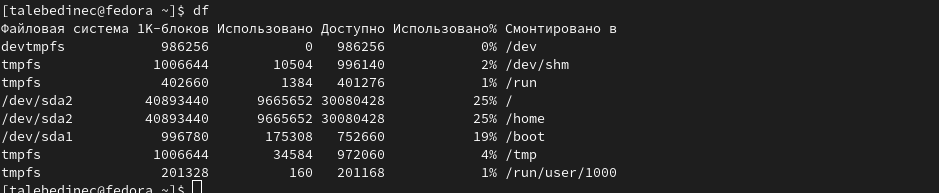 {#fig:010 width=70%}

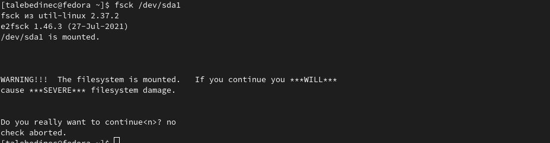 {#fig:011 width=70%}

***Шаг 2*** 
2.1 Скопируем файл /usr/include/sys/io.h в домашний каталоги назовем его
equipment.
2.2. В домашнем каталоге создаем директорию ~/ski.plases.
2.3. Переместим файл equipment в каталог ~/ski.plases.
2.4. Переименуем файл ~/ski.plases/equipment в ~/ski.plases/equiplist.
2.5. Создаем в домашнем каталоге файл abc1 и скопируем его в каталог
~/ski.plases,назовем его equiplist2.
2.6. Создаем каталог с именем equipment в каталоге ~/ski.plases.
2.7. Переместим файлы ~/ski.plases/equiplist и equiplist2 в каталог
~/ski.plases/equipment.
2.8. Создаем и переместим каталог ~/newdir в каталог ~/ski.plases и назовем
его plans(рис. [@fig:012])

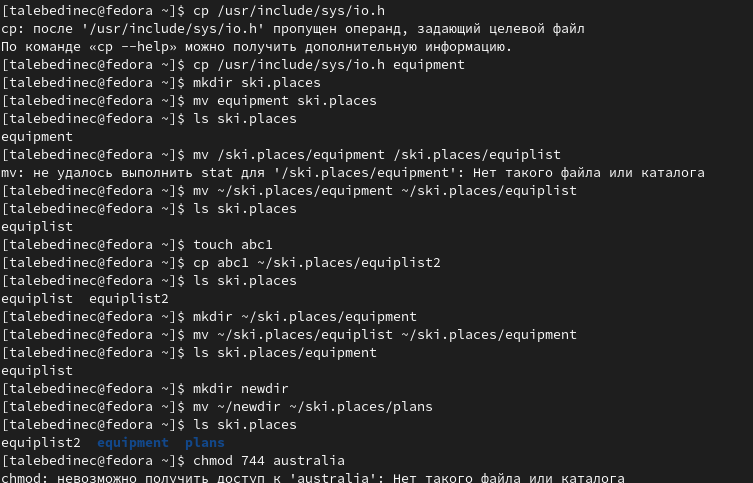 {#fig:012 width=70%}

***Шаг 3***
Определим опции команды chmod,необходимые для того,чтобы присвоить перечис-
ленным ниже файлам выделенные права доступа, считая, что в начале таких прав
нет:
3.1. drwxr--r-- ... australia
3.2. drwx--x--x ... play
3.3. -r-xr--r-- ... my_os
3.4. -rw-rw-r-- ... feathers (рис. [@fig:013])

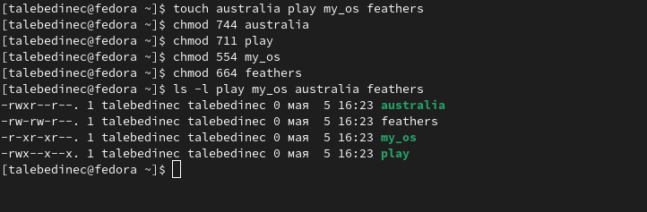 {#fig:013 width=70%}

***Шаг 4***
Проделаем приведённые ниже упражнения, записывая в отчёт по лабораторной
работе используемые при этом команды:
4.1. Просмотрим содержимое файла /etc/password. (рис. [@fig:015])
4.2. Скопируем файл ~/feathers в файл ~/file.old. (рис. [@fig:015])
4.3. Переместим файл ~/file.old в каталог ~/play. (рис. [@fig:015])
4.4. Скопируем каталог ~/play в каталог ~/fun. (рис. [@fig:015])
4.5. Переместим каталог ~/fun в каталог ~/play и назовите его games. (рис. [@fig:015])
4.6. Лишим владельца файла ~/feathers права на чтение. (рис. [@fig:015])
4.7. Узнаем, что произойдёт,если мы попытаемся просмотреть файл ~/feathers командой cat? (рис. [@fig:015])
4.8. Узнаем, что произойдёт,если мы попытаемся скопировать файл ~/feathers?
4.9. Дадим владельцу файла ~/feathers право на чтение. (рис. [@fig:016])
4.10. Лишим владельца каталога ~/play права на выполнение. (рис. [@fig:016])
4.11. Перейдем в каталог ~/play.Что произошло? (рис. [@fig:016])
4.12. Дадим владельцу каталога ~/play право на выполнение. (рис. [@fig:016])

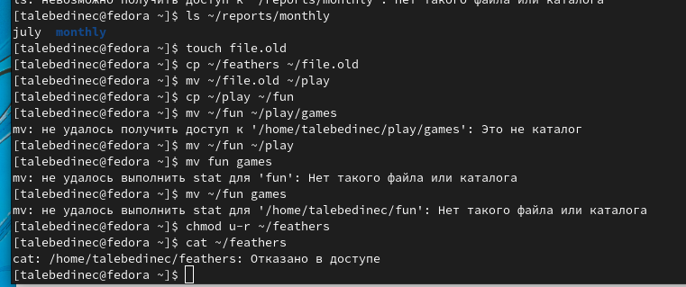 {#fig:015 width=70%}

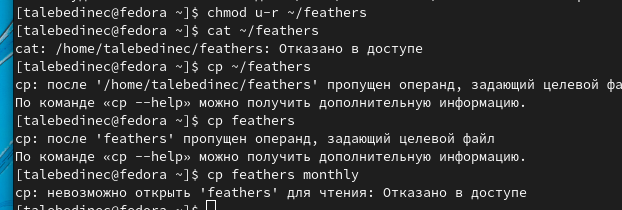 {#fig:016 width=70%}

***Шаг 5*** 
Прочитаем man по командам mount,fsck,mkfs,kill и кратко их охарактеризуйте,
приведя примеры. 
1. mount (рис. [@fig:018])
2. fsck (рис. [@fig:019])
3. mkfs (рис. [@fig:020])
4. kill (рис. [@fig:021])

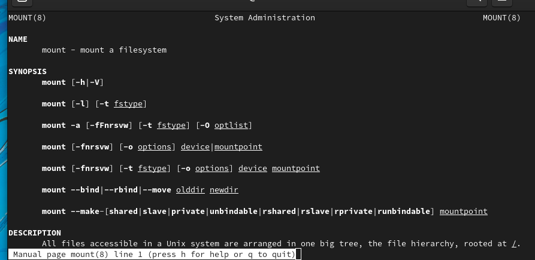 {#fig:018 width=70%}

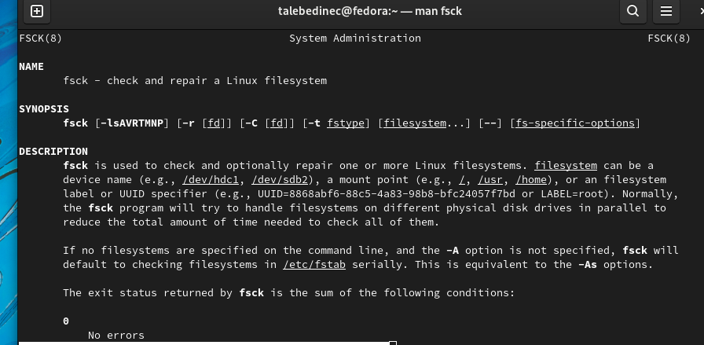 {#fig:019 width=70%}

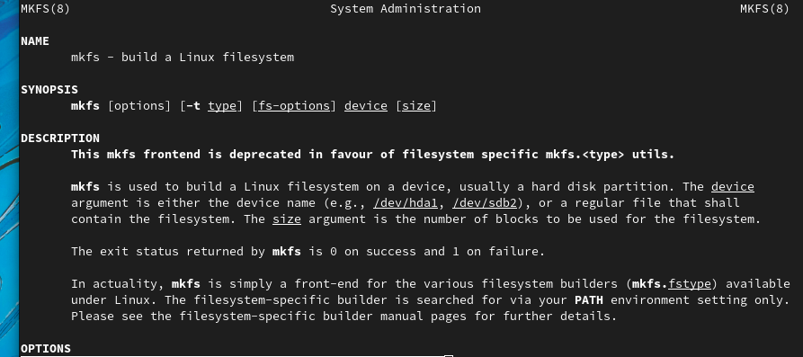 {#fig:020 width=70%}

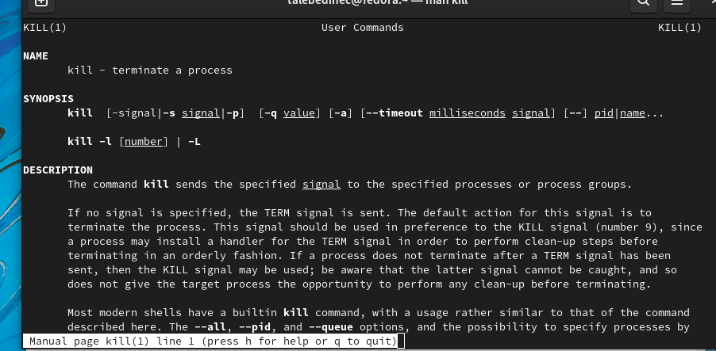 {#fig:021 width=70%}

# Выводы

Я ознакомилась с файловой системой, приобрела практические навыки по применению команд для работы с файлами и каталогами.

# Список литературы{.unnumbered}

::: {#refs}
:::
