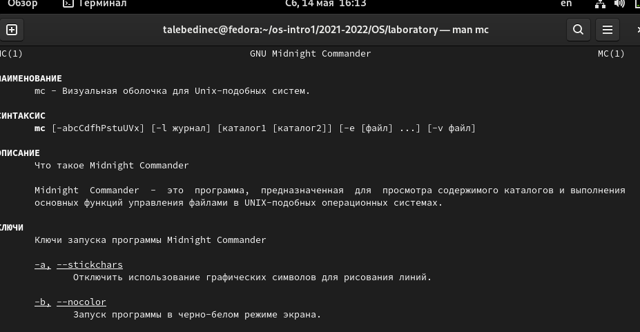
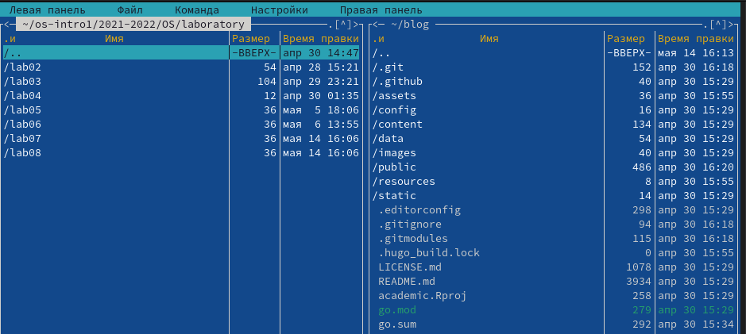
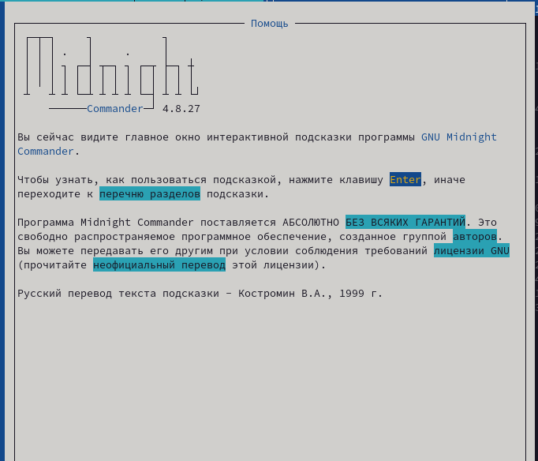
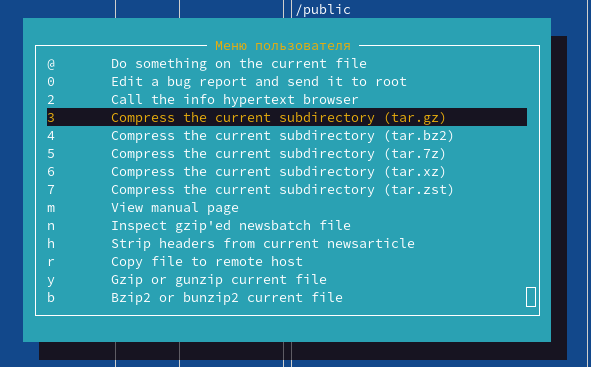
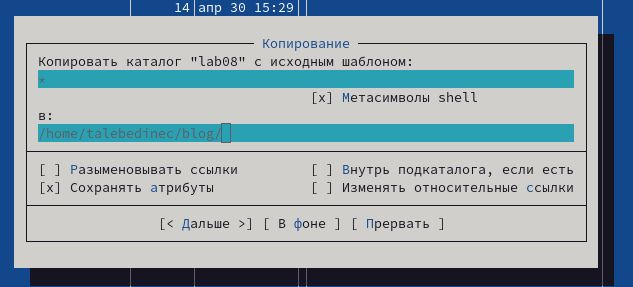
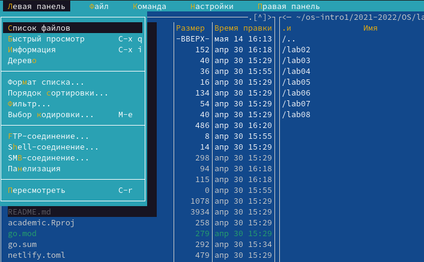
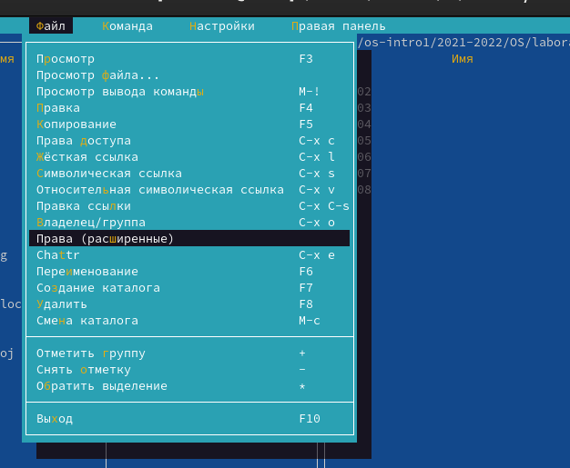
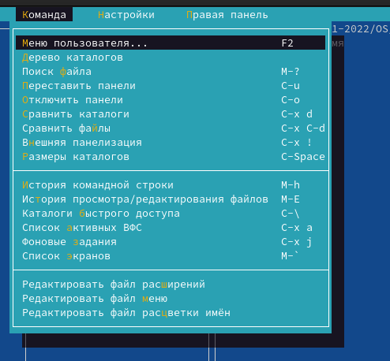
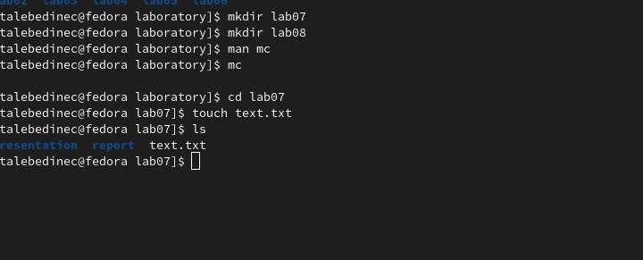
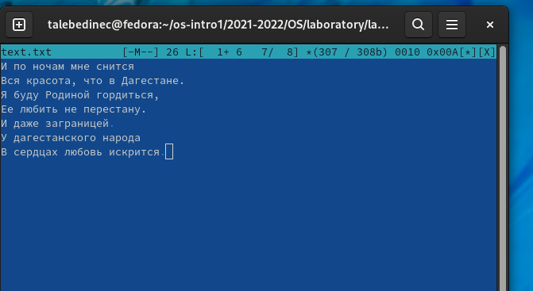

---
## Front matter
lang: ru-RU
title: /Отчет по лр №5
author: /Татьяна Лебединец НПМбд-02-21
institute: |
	\inst{1}RUDN University, Moscow, Russian Federation
	
date: NEC--2019, 30 September -- 4 October, 2019 Budva, Montenegro

## Formatting
toc: false
slide_level: 2
theme: metropolis
header-includes: 
 - \metroset{progressbar=frametitle,sectionpage=progressbar,numbering=fraction}
 - '\makeatletter'
 - '\beamer@ignorenonframefalse'
 - '\makeatother'
aspectratio: 43
section-titles: true
---

# Ход работы

# Цель работы

Освоение основных возможностей командной оболочки Midnight Commander. Приобретение навыков практической работы попросмотру каталогов и файлов, манипуляций с ними.

# Задание

Выполнение заданий, представленных в методичке.

# Выполнение лабораторной работы

#Задание 1

    ***1.***
    Изучаем информацию о mc, вызвав в командной строке «man mc». Midnight Commander (или mc) − псевдографическая командная оболочка для UNIX/Linux систем. (рис. -@fig:001)
 {#fig:001 width=70%}
    

    ***2.***
     Запустим из командной строки mc и изучим его структуру и меню. (рис. -@fig:002)

 {#fig:002 width=70%}

* Нажав клавиши «fn»+«F1», можно открыть «Помощь». (рис. -@fig:009)
* Нажав клавиши «fn»+«F2», можно открыть «Меню пользователя». (рис. -@fig:010)

 {#fig:009 width=70%}
 {#fig:010 width=70%}

    ***3.***
     
    Выполним несколько операций в mc, используя управляющие клавиши
* Операции с панелями. Меняем панели местами с помощью клавиш "Сtrl"+"u" или же в команде меню "Управление панелями". Изменяем режим панелей на "Дерево" и "Информация".
* Выделение/отмена выделения файлов. Используем клавишу «ins» и выделяем необходимые файлы. Для выделения файлов или его отмены можно использовать также пункты «Отметить группу», «Снять отметку», «Обратить выделение» в меню «Файл».
* Копирование/перемещение файлов. Для копирования файла используются клавиши «fn»+«F5». Для перемещения файла используются клавиши «fn»+«F6». (рис. -@fig:013)

 {#fig:013 width=70%}
* Получение информации о размере и правах доступа на файлы и/или каталоги.Для получения данной информации можно перейти в пункты: «Левая панель» → «Информация», «Левая панель» → «Формат списка» → «Расширенный», «Файл» → «Права доступа», «Файл» → «Права (расширенные). 
* и так далее

    ***4.***
     
    Выполним основные команды меню левой панели. (рис. -@fig:019)

* Пункт «Список файлов» отображает размер файла и время его правки.

* Пункт «Быстрый просмотр» необходим для предпросмотра содержания файла. К сожалению, ни один файл не открылся. 
* Пункт «Информация» отображает подробные данные о файле.
* Пункт «Дерево» необходим для просмотра дерева каталога.
* Пункт «Формат списка» − «Укороченный» отображает только имя файла или каталога. Пункт «Формат списка» − «Расширенный» отображает подробную информацию о файлах. Пункт «Формат списка» − «Определенный пользователем» предоставляет пользователю возможность самому изменять степень подробности информации о файле. Пункт «Формат списка» − «Стандартный» ставится по умолчанию.
* Пункт «Порядок сортировки» необходим для сортировки файлов или каталогов по конкретному критерию. 
* Пункт «Фильтр» необходим, чтобы просматривать название файлов или каталогов, которые подходят под указанную маску.

 {#fig:019 width=70%}

    ***5.***
     Используя возможности подменю «Файл», выполним: (рис. -@fig:026) 
* Просмотр содержимого текстового файла. Выберем текстовый файл и перейдем в пункт «Просмотр». 
* Редактирование содержимого текстового файла (без сохранения результатов редактирования). Перейдем в пункт «Правка» и изменим текст.
* Создание каталога. Перейдем в пункт «Создание каталога» и создадим каталог 123.
* Копируем файл в созданный каталог. 
 {#fig:026 width=70%}

    ***6.*** С помощью соответствующих средств подменю «Команда» выполним: (рис. -@fig:027)
* Поиск в файловой системе файла с заданными условиями. Перейдем в пункт «Поиск файла» и зададим следующие параметры: «От каталога» /, «Шаблон имени» *.сpp, «Содержимое» main, выполним поиск.
* Выбор и повторение одной из предыдущих команд.Перейдем в пункт «История командной строки» и увидим, что внизу экрана появилась сноска «История», выполним одну из предыдущих команд. 
* Переход в домашний каталог. Для перехода в домашний каталог перейдем в пункт «Дерево каталогов», выберем необходимый каталог и нажмем «enter», в результате чего, в перейдем в домашний каталог. 
* Анализ файла меню и файла расширений. Перейдем в пункт «Редактировать файл расширений». "Редактировать файл расширений" − позволяет задать с помощью определённого синтаксиса действия при запуске файлов с определённым расширением. 
* Пункт «Редактировать файл меню» − позволяет отредактировать контекстное меню пользователя.
* Вызовем подменю «Настройки". Освоим операции, определяющие структуру экрана mc.

 {#fig:027 width=70%}

    
#Задание 2. 
	***7.*** 
С помощью команды «touch text.txt» создаем текстовой файл text.txt. Командой «ls» проверяем правильность выполненных действий. (рис. -@fig:030)

 {#fig:030 width=70%}

    ***8.*** 
    Открываем этот файл с помощью встроенного mc редактора командой «mcedit text.txt». 

    ***9.***
     Вставим небольшой фагмент текста из интернета. (рис. -@fig:032)

 {#fig:032 width=70%}

    ***10.*** 
    * Удаляем 1-ю строку текста с помощью клавиш «fn»+«F8». 
    * Выделим фрагмент текста, нажав «fn»+«F3» для начала выделения текста и для его окончания, и скопируем его на новую строку, используя клавиши «fn»+«F5». 
    * Выделим фрагмент текста и перенесем его на новую строку с помощью клавиш «fn»+«F6».
    * Сохраним файл, нажав «fn»+«F2». 
    * Отменим последнее действие с помощью клавиш «ctrl»+«u».
    * Перейдем в конец файла, нажав клавиши «ctrl»+«end» (переход в конец файла) и «ctrl»+«x» (переход в конец следующего слова) и напишем следующий текст «Лес красив осенью». Перейдем в начало файла, нажав клавиши «ctrl»+«home» (переход в начало файла) и «ctrl»+«z» (переход в начало следующего слова) и напишем следующий текст «Лес красив осенью».
    * Выполним сохранение файла (клавиши «fn»+«F2») и выход из него (клавиши «fn»+«F10»).

    ***11.*** Откроем файл с исходным текстом на некотором языке программирования. Откроем файл в редакторе mc с помощью команды «mc/123.cpp». 

	

# Выводы

Я освоила основные возможности командной оболочки Midnight Commander и приобрела навыки практической работы по просмотру каталогов и файловб, манипуляций с ними.

## {.standout}

