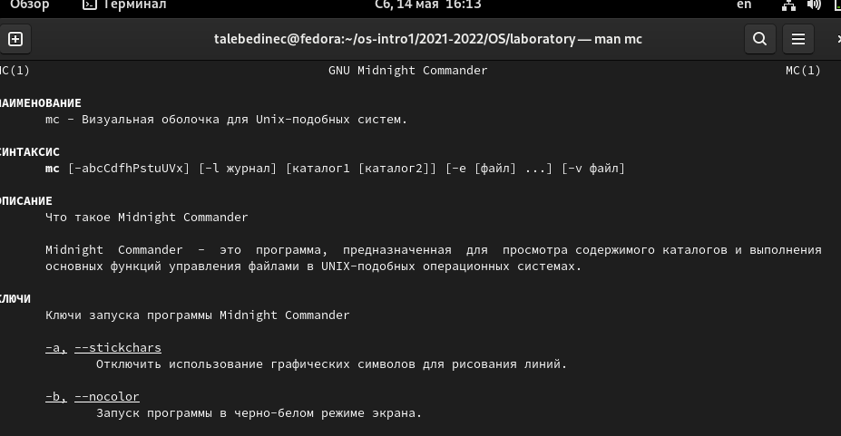
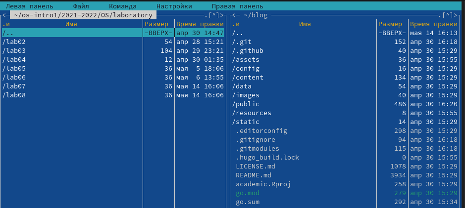
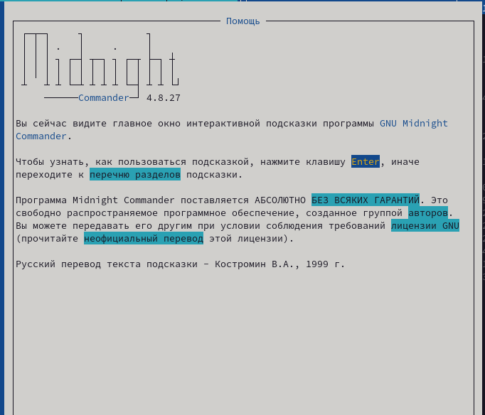
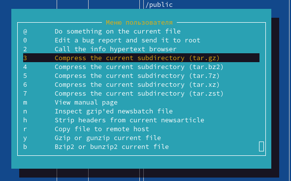
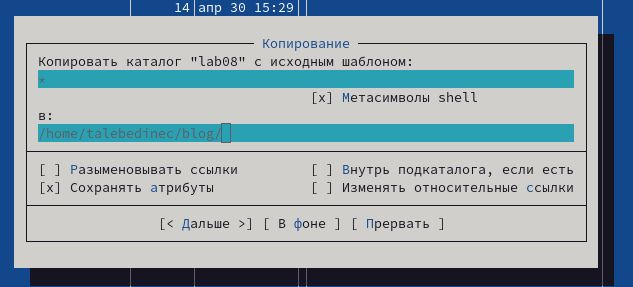
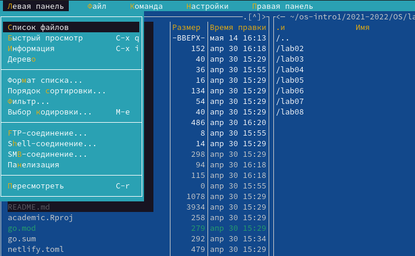
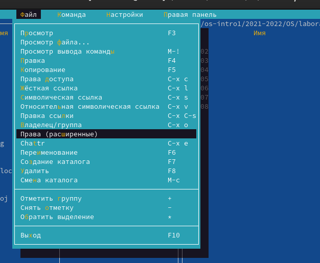
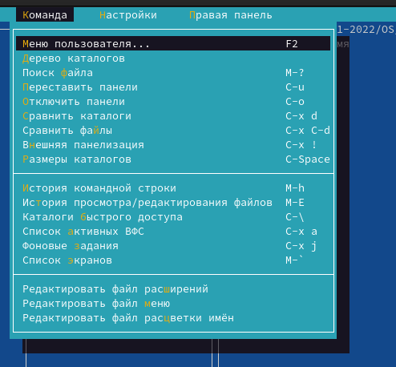
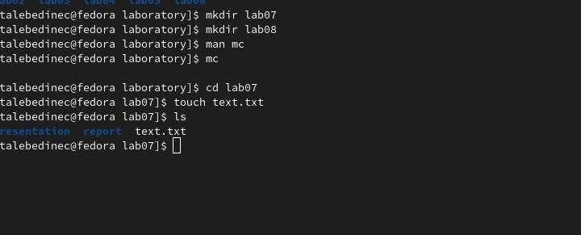
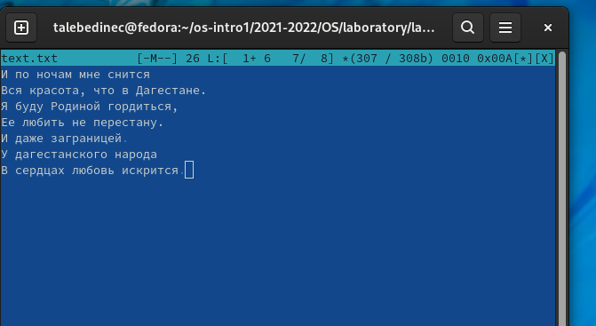

---
## Front matter
title: "Отчёт по лабораторной работе №7"
subtitle: "Дисциплина: Операционные системы"
author: "Татьяна Александровна Лебединец"

## Generic otions
lang: ru-RU
toc-title: "Содержание"

## Bibliography
bibliography: bib/cite.bib
csl: pandoc/csl/gost-r-7-0-5-2008-numeric.csl

## Pdf output format
toc: true # Table of contents
toc-depth: 2
lof: true # List of figures
lot: true # List of tables
fontsize: 12pt
linestretch: 1.5
papersize: a4
documentclass: scrreprt
## I18n polyglossia
polyglossia-lang:
  name: russian
  options:
	- spelling=modern
	- babelshorthands=true
polyglossia-otherlangs:
  name: english
## I18n babel
babel-lang: russian
babel-otherlangs: english
## Fonts
mainfont: PT Serif
romanfont: PT Serif
sansfont: PT Sans
monofont: PT Mono
mainfontoptions: Ligatures=TeX
romanfontoptions: Ligatures=TeX
sansfontoptions: Ligatures=TeX,Scale=MatchLowercase
monofontoptions: Scale=MatchLowercase,Scale=0.9
## Biblatex
biblatex: true
biblio-style: "gost-numeric"
biblatexoptions:
  - parentracker=true
  - backend=biber
  - hyperref=auto
  - language=auto
  - autolang=other*
  - citestyle=gost-numeric
## Pandoc-crossref LaTeX customization
figureTitle: "Рис."
tableTitle: "Таблица"
listingTitle: "Листинг"
lofTitle: "Список иллюстраций"
lotTitle: "Список таблиц"
lolTitle: "Листинги"
## Misc options
indent: true
header-includes:
  - \usepackage{indentfirst}
  - \usepackage{float} # keep figures where there are in the text
  - \floatplacement{figure}{H} # keep figures where there are in the text
---

# Цель работы

Освоение основных возможностей командной оболочки Midnight Commander. Приобретение навыков практической работы попросмотру каталогов и файлов, манипуляций с ними.

# Задание

Выполнение заданий, представленных в методичке.

# Выполнение лабораторной работы

#Задание 1

    ***1.***
    Изучаем информацию о mc, вызвав в командной строке «man mc». Midnight Commander (или mc) − псевдографическая командная оболочка для UNIX/Linux систем. (рис. -@fig:001)
 {#fig:001 width=70%}
    

    ***2.***
     Запустим из командной строки mc и изучим его структуру и меню. (рис. -@fig:002)

 {#fig:002 width=70%}

* Нажав клавиши «fn»+«F1», можно открыть «Помощь». (рис. -@fig:009)
* Нажав клавиши «fn»+«F2», можно открыть «Меню пользователя». (рис. -@fig:010)

 {#fig:009 width=70%}
 {#fig:010 width=70%}

    ***3.***
     
    Выполним несколько операций в mc, используя управляющие клавиши
* Операции с панелями. Меняем панели местами с помощью клавиш "Сtrl"+"u" или же в команде меню "Управление панелями". Изменяем режим панелей на "Дерево" и "Информация".

* Выделение/отмена выделения файлов. Используем клавишу «ins» и выделяем необходимые файлы. Для выделения файлов или его отмены можно использовать также пункты «Отметить группу», «Снять отметку», «Обратить выделение» в меню «Файл».
* Копирование/перемещение файлов. Для копирования файла используются клавиши «fn»+«F5». Для перемещения файла используются клавиши «fn»+«F6». (рис. -@fig:013)

 {#fig:013 width=70%}
* Получение информации о размере и правах доступа на файлы и/или каталоги.Для получения данной информации можно перейти в пункты: «Левая панель» → «Информация», «Левая панель» → «Формат списка» → «Расширенный», «Файл» → «Права доступа», «Файл» → «Права (расширенные). 
* и так далее

    ***4.***
     
    Выполним основные команды меню левой панели. (рис. -@fig:019)

* Пункт «Список файлов» отображает размер файла и время его правки.

* Пункт «Быстрый просмотр» необходим для предпросмотра содержания файла. К сожалению, ни один файл не открылся. 
* Пункт «Информация» отображает подробные данные о файле.
* Пункт «Дерево» необходим для просмотра дерева каталога.
* Пункт «Формат списка» − «Укороченный» отображает только имя файла или каталога. Пункт «Формат списка» − «Расширенный» отображает подробную информацию о файлах. Пункт «Формат списка» − «Определенный пользователем» предоставляет пользователю возможность самому изменять степень подробности информации о файле. Пункт «Формат списка» − «Стандартный» ставится по умолчанию.
* Пункт «Порядок сортировки» необходим для сортировки файлов или каталогов по конкретному критерию. 
* Пункт «Фильтр» необходим, чтобы просматривать название файлов или каталогов, которые подходят под указанную маску.

 {#fig:019 width=70%}

    ***5.***
     Используя возможности подменю «Файл», выполним: (рис. -@fig:026) 
* Просмотр содержимого текстового файла. Выберем текстовый файл и перейдем в пункт «Просмотр». 
* Редактирование содержимого текстового файла (без сохранения результатов редактирования). Перейдем в пункт «Правка» и изменим текст.
* Создание каталога. Перейдем в пункт «Создание каталога» и создадим каталог 123.
* Копируем файл в созданный каталог. 

 {#fig:026 width=70%}

    ***6.*** С помощью соответствующих средств подменю «Команда» выполним: (рис. -@fig:027)
* Поиск в файловой системе файла с заданными условиями. Перейдем в пункт «Поиск файла» и зададим следующие параметры: «От каталога» /, «Шаблон имени» *.сpp, «Содержимое» main, выполним поиск.
* Выбор и повторение одной из предыдущих команд.Перейдем в пункт «История командной строки» и увидим, что внизу экрана появилась сноска «История», выполним одну из предыдущих команд. 
* Переход в домашний каталог. Для перехода в домашний каталог перейдем в пункт «Дерево каталогов», выберем необходимый каталог и нажмем «enter», в результате чего, в перейдем в домашний каталог. 
* Анализ файла меню и файла расширений. Перейдем в пункт «Редактировать файл расширений». "Редактировать файл расширений" − позволяет задать с помощью определённого синтаксиса действия при запуске файлов с определённым расширением. 
* Пункт «Редактировать файл меню» − позволяет отредактировать контекстное меню пользователя.
* Вызовем подменю «Настройки". Освоим операции, определяющие структуру экрана mc.

 {#fig:027 width=70%}

    
#Задание 2. 
	***7.*** 
С помощью команды «touch text.txt» создаем текстовой файл text.txt. Командой «ls» проверяем правильность выполненных действий. (рис. -@fig:030)

 {#fig:030 width=70%}

    ***8.*** 
    Открываем этот файл с помощью встроенного mc редактора командой «mcedit text.txt». 

    ***9.***
     Вставим небольшой фагмент текста из интернета. (рис. -@fig:032)

 {#fig:032 width=70%}

    ***10.*** 
    * Удаляем 1-ю строку текста с помощью клавиш «fn»+«F8». 
    * Выделим фрагмент текста, нажав «fn»+«F3» для начала выделения текста и для его окончания, и скопируем его на новую строку, используя клавиши «fn»+«F5». 
    * Выделим фрагмент текста и перенесем его на новую строку с помощью клавиш «fn»+«F6».
    * Сохраним файл, нажав «fn»+«F2». 
    * Отменим последнее действие с помощью клавиш «ctrl»+«u».
    * Перейдем в конец файла, нажав клавиши «ctrl»+«end» (переход в конец файла) и «ctrl»+«x» (переход в конец следующего слова) и напишем следующий текст «Лес красив осенью». Перейдем в начало файла, нажав клавиши «ctrl»+«home» (переход в начало файла) и «ctrl»+«z» (переход в начало следующего слова) и напишем следующий текст «Лес красив осенью».
    * Выполним сохранение файла (клавиши «fn»+«F2») и выход из него (клавиши «fn»+«F10»).

    ***11.*** Откроем файл с исходным текстом на некотором языке программирования. Откроем файл в редакторе mc с помощью команды «mc/123.cpp». 

	

# Выводы

Я освоила основные возможности командной оболочки Midnight Commander и приобрела навыки практической работы по просмотру каталогов и файловб, манипуляций с ними.

#Контрольные вопросы

    

    Панели могут дополнительно быть переведены в один из двух режимов: «Информация» или «Дерево». В режиме «Информация» на панель выводятся сведения о файле и текущей файловой системе, расположенных на активной панели. В режиме «Дерево» на одной из панелей выводится структура дерева каталогов.

    Как с помощью команд shell, так и с помощью меню (комбинаций клавиш) mc можно выполнить следующие операции с файлами:

    копирование «F5» («cp имя_файла имя_каталога(в который копируем)»)
    перемещение/переименование «F6» («mv имя_файла имя_каталога(в который перемещаем)»)
    создание каталога «F7» («mkdir имя_каталога»)
    удаление «F8» («rm имя_файла»)
    изменение прав доступа «ctrl+x» («chmod u+x имя_файла»)

    Перейти в строку меню панелей mc можно с помощью функциональной клавиши «F9». В строке меню имеются пять меню: «Левая панель», «Файл», «Команда», «Настройки» и «Правая панель». Подпункт меню «Быстрый просмотр» позволяет выполнить быстрый просмотр содержимого панели. Подпункт меню «Информация» позволяет посмотреть информацию о файле или каталоге. В меню каждой (левой или правой) панели можно выбрать «Формат списка»:

    стандартный − выводит список файлов и каталогов с указанием размера и времени правки;
    ускоренный − позволяет задать число столбцов, на которые разбивается панель при выводе списка имён файлов или каталогов без дополнительной информации;
    расширенный − помимо названия файла или каталога выводит сведения о правах доступа, владельце, группе, размере, времени правки;
    определённый пользователем − позволяет вывести те сведения о файле или каталоге, которые задаст сам пользователь.Подпункт меню «Порядок сортировки» позволяет задать критерии сортировки при выводе списка файлов и каталогов: без сортировки, по имени, расширенный, время правки, время доступа, время изменения атрибута, размер, узел.

Команды меню «Файл»:

    Просмотр («F3») − позволяет посмотреть содержимое текущего (или выделенного) файла без возможности редактирования.
    Просмотр вывода команды («М» + «!») − функция запроса команды с параметрами (аргумент к текущему выбранному файлу).
    Правка («F4») − открывает текущий (или выделенный) файл для его редактирования.
    Копирование («F5») − осуществляет копирование одного или нескольких файлов или каталогов в указанное пользователем во всплывающем окне место.
    Права доступа («Ctrl-x» «c») − позволяет указать (изменить) права доступа к одному или нескольким файлам или каталогам.
    Жёсткая ссылка («Ctrl-x» «l») − позволяет создать жёсткую ссылку к текущему (или выделенному) файлу.
    Символическая ссылка («Ctrl-x» «s») − позволяет создать cимволическую ссылку к текущему (или выделенному) файлу.
    Владелец/группа («Ctrl-x» «o») − позволяет задать (изменить) владельца и имя группы для одного или нескольких файлов или каталогов.
    Права (расширенные) − позволяет изменить права доступа и владения для одного или нескольких файлов или каталогов.
    Переименование («F6») − позволяет переименовать (или переместить) один или несколько файлов или каталогов.
    Создание каталога («F7») − позволяет создать каталог.
    Удалить («F8») − позволяет удалить один или несколько файловили каталогов.
    Выход («F10») − завершает работу mc.

    Меню Команда В меню Команда содержатся более общие команды для работы с mc. Команды меню Команда:

    Дерево каталогов − отображает структуру каталогов системы.
    Поиск файла − выполняет поиск файлов по заданным параметрам.
    Переставить панели − меняет местами левую и правую панели.
    Сравнить каталоги («Ctrl-x» «d») − сравнивает содержимое двух каталогов.
    Размеры каталогов − отображает размер и время изменения каталога (по умолчанию в mc размер каталога корректно не отображается).
    История командной строки − выводит на экран список ранее выполненных в оболочке команд.
    Каталоги быстрого доступа ( Ctrl-\») − при вызове выполняется быстрая смена текущего каталога на один из заданного списка.
    Восстановление файлов − позволяет восстановить файлы на файловых системах ext2 и ext3.
    Редактировать файл расширений − позволяет задать с помощью определённого синтаксиса действия при запуске файлов с определённым расширением (например, какое программного обеспечение запускать для открытия или редактирования файлов с расширением doc или docx).
    Редактировать файл меню − позволяет отредактировать контекстное меню пользователя, вызываемое по клавише «F2».
    Редактировать файл расцветки имён − позволяет подобрать оптимальную для пользователя расцветку имён файлов в зависимости от их типа.

    Меню Настройки содержит ряд дополнительных опций по внешнему виду и функциональности mc. Меню Настройки содержит:

    Конфигурация − позволяет скорректировать настройки работы с панелями.
    Внешний вид и Настройки панелей − определяет элементы(строка меню, командная строка, подсказки и прочее), отображаемые при вызове mc, а также геометрию расположения панелей и цветовыделение.
    Биты символов − задаёт формат обработки информации локальным терминалом.
    Подтверждение − позволяет установить или убрать вывод окна с запросом подтверждения действий при операциях удаления и перезаписи файлов, а также при выходе из программы.
    Распознание клавиш − диалоговое окно используется для тестирования функциональных клавиш, клавиш управления курсором и прочее.
    Виртуальные ФС − настройки виртуальной файловой системы: тайм-аут, пароль и прочее.

    Функциональные клавиши mc:

    F1 – вызов контекстно-зависимой подсказки
    F2 – вызов пользовательского меню с возможностью создания и/или дополнения дополнительных функций
    F3 – просмотр содержимого файла, на который указывает подсветка в активной панели (без возможности редактирования)
    F4 – вызов встроенного в mc редактора для изменения содержания файла, на который указывает подсветка в активной панели
    F5 – копирование одного или нескольких файлов, отмеченныхв первой (активной) панели, в каталог, отображаемый на второй панели
    F6 – перенос одного или нескольких файлов, отмеченных в первой (активной) панели, в каталог, отображаемый на второй панели
    F7 – создание подкаталога в каталоге, отображаемом в активной панели
    F8 – удаление одного или нескольких файлов (каталогов), отмеченных в первой (активной) панели файлов
    F9 – вызов меню mc
    F10 – выход из mc

    Встроенный в mc редактор вызывается с помощью функциональной клавиши «F4». В нём удобно использовать различные комбинации клавиш при редактировании содержимого (как правило текстового) файла. Клавиши для редактирования файла:

    «Ctrl-y» − удалить строку
    «Ctrl-u» − отмена последней операции
    «ins» вставка/замена
    «F7» − поиск (можно использовать регулярные выражения)
    «↑-F7» − повтор последней операции поиска
    «F4» − замена
    «F3» − первое нажатие − начало выделения, второе − окончание выделения
    «F5» − копировать выделенный фрагмент
    «F6» − переместить выделенный фрагмент
    «F8» − удалить выделенный фрагмент
    «F2» − записать изменения в файл
    «F10» − выйти из редактор

    Для редактирования меню пользователя, которое вызывается клавишей «F2», необходимо перейти в пункт «Редактировать файл меню» - «Команда» и изменить настройки файла.

    Часть команд «Меню пользователя», а также меню «Файл» позволяют выполнять действия, определяемые пользователем, над текущим файлом. Например, копирование каталога или файла,переименование, перемещение, архивирование.

# Список литературы{.unnumbered}

::: {#refs}
:::
