---
## Front matter
lang: ru-RU
title: /Отчет по лр №5
author: /Татьяна Лебединец НПМбд-02-21
institute: |
	\inst{1}RUDN University, Moscow, Russian Federation
	
date: NEC--2019, 30 September -- 4 October, 2019 Budva, Montenegro

## Formatting
toc: false
slide_level: 2
theme: metropolis
header-includes: 
 - \metroset{progressbar=frametitle,sectionpage=progressbar,numbering=fraction}
 - '\makeatletter'
 - '\beamer@ignorenonframefalse'
 - '\makeatother'
aspectratio: 43
section-titles: true
---

# Ход работы

## ***Шаг 1***

    ***1.***
    Создаем каталог в домашней папке work/os/lab06. Переходим во вновь созданный каталог. (рис. -@fig:001)
    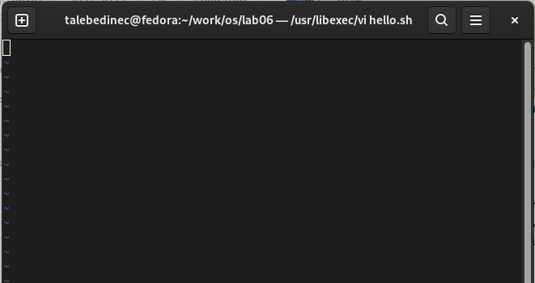 {#fig:001 width=70%}

    ***2.***
     Вызываем vi и создаем файл hello.sh с помощью команды «vi hello.sh». (рис. -@fig:002) (рис. -@fig:003)

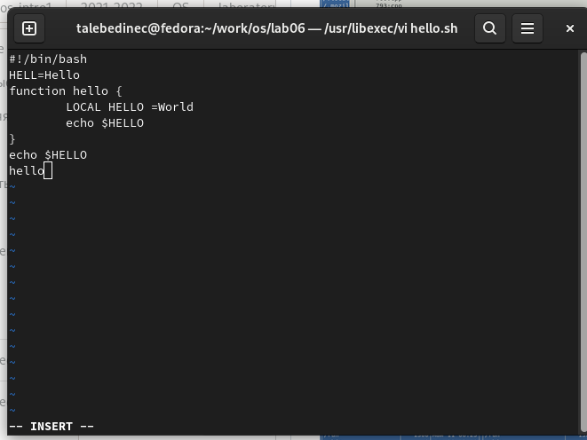 {#fig:002 width=70%}

    ***3.***
     Нажимаем клавишу «i» и вводим текст, указанный в лабораторной работе. (рис. -@fig:004)
 {#fig:004 width=70%} 
     
    ***4.***
     Нажимаем клавишу «esc», чтобы перейти в командный режим после завершения ввода текста. (рис. -@fig:005)
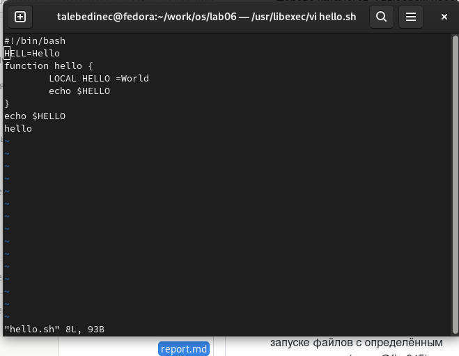 {#fig:005 width=70%}
    ***5.***
     Нажимаем «:» для перехода в режим последней строки и внизу экрана видим, что появилось приглашение в виде двоеточия. (рис. -@fig:006)

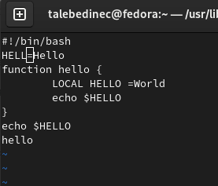 {#fig:006 width=70%}

    ***6.*** Нажимаем «w» (записать) и «q» (выйти), далее нажимаем клавишу «enter» для сохранения текста и завершения работы. (рис. -@fig:007)

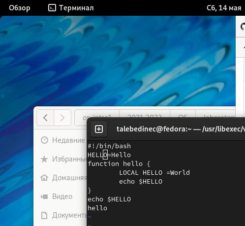 {#fig:007 width=70%}
    ***7.*** 
    Чтобы сделать файл исполняемым, используем команду «chmod +x hello.sh». (рис. -@fig:008)
    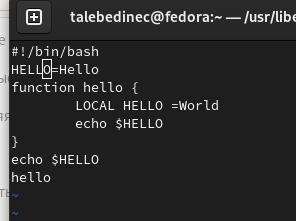 {#fig:008 width=70%}

#Задание 2

    ***8.*** 
    Вызовем vi для редактирования файла с помощью команды «vi ~/work/os/lab06/hello.sh». (рис. -@fig:009)

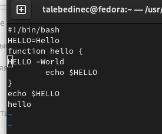 {#fig:009 width=70%}

    ***9.***
     Далее с помощью стрелок установила курсор в конец слова HELL второй строки. (рис. -@fig:010)

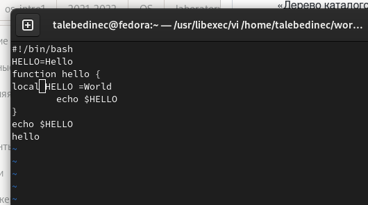 {#fig:010 width=70%}

    ***10.*** Перейдем в режим вставки, нажав на клавишу «i», и заменим HELL на HELLO, дописав O. Нажмем «esc» для возврата в командный режим. (рис. -@fig:011)

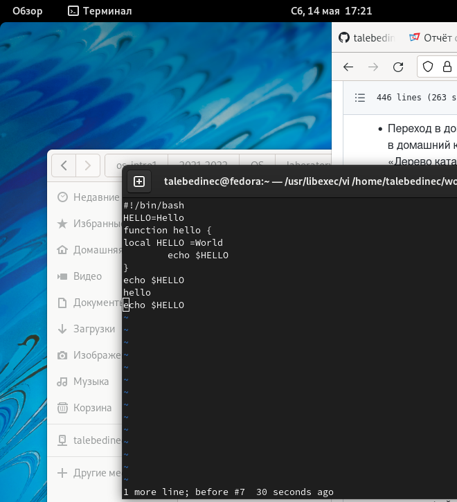 {#fig:011 width=70%}

    ***11.*** С помощью стрелок установим курсор на четвертую строку и сотрем слово LOCAL с помощью комбинации клавиш «d» и «w». (рис. -@fig:012)

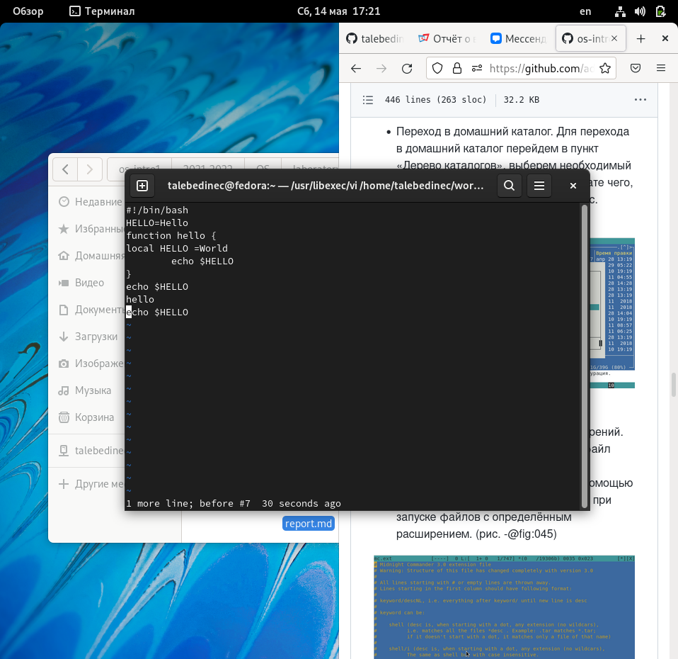 {#fig:012 width=70%}
    
    ***12.***
    Перейдем в режим вставки, нажав клавишу «i», и наберем следующий текст: local. Нажмем «esc» для возврата в командный режим. (рис. -@fig:013)
    
    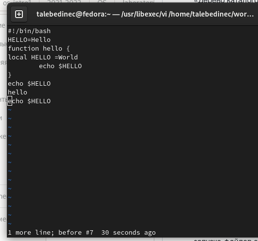 {#fig:013 width=70%}
    
    Установим курсор на последней строке файла, используя стрелки. Вставим после неё строку, содержащую следующий текст: echo $HELLO. 
    Нажимаем «esc», чтобы перейти в командный режим.
    Удаляем последнюю строку, используя комбинацию клавиш «d» и «d».
    Введем команду отмены изменений «u» для отмены последней команды. 
    Введем символ «:» для перехода в режим последней строки. Запишем произведённые изменения, нажав «w» и «q» и выйдем из vi. (рис. -@fig:016)

 {#fig:016 width=70%}

## {.standout}

