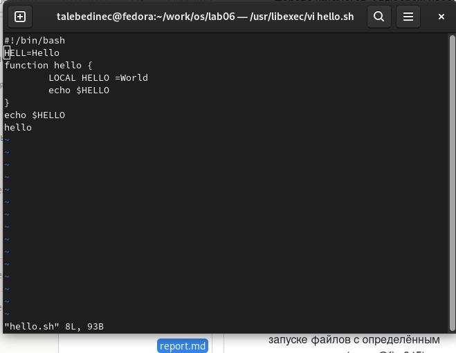
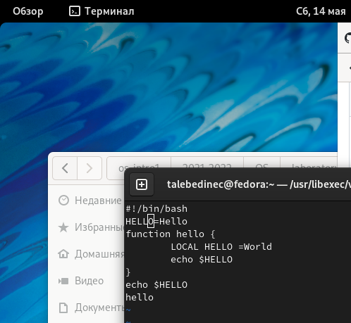
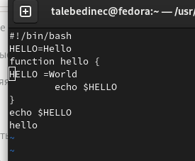
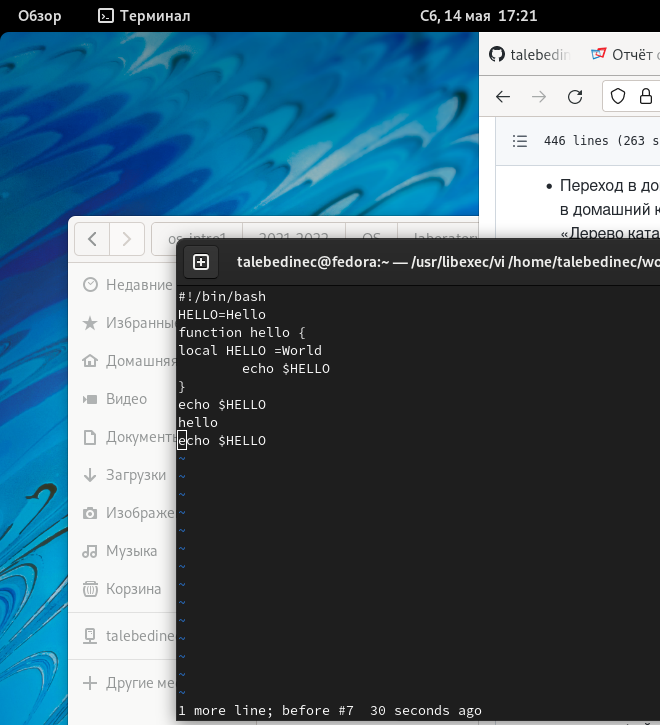
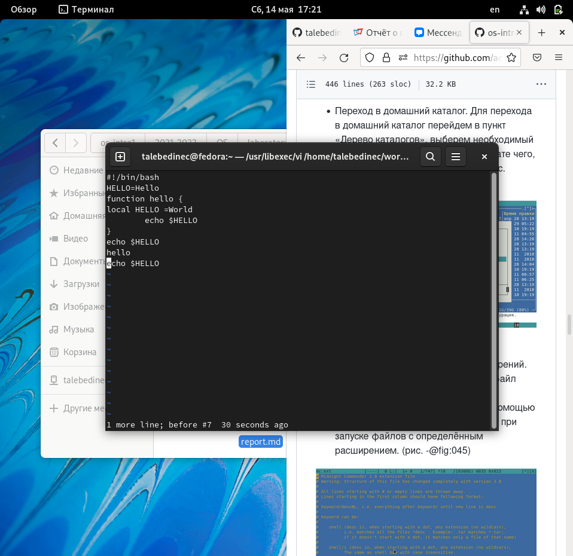
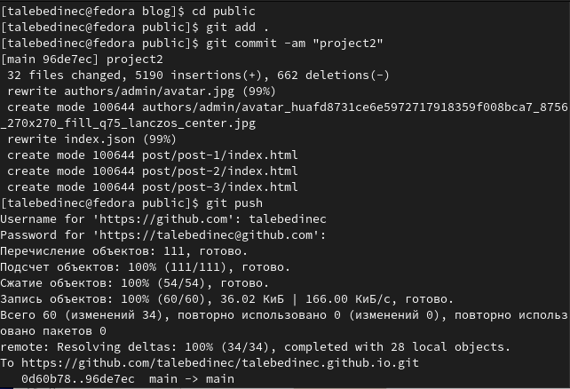

---
## Front matter
title: "Отчёт по лабораторной работе №8"
subtitle: "Дисциплина: Операционные системы"
author: "Татьяна Александровна Лебединец"

## Generic otions
lang: ru-RU
toc-title: "Содержание"

## Bibliography
bibliography: bib/cite.bib
csl: pandoc/csl/gost-r-7-0-5-2008-numeric.csl

## Pdf output format
toc: true # Table of contents
toc-depth: 2
lof: true # List of figures
lot: true # List of tables
fontsize: 12pt
linestretch: 1.5
papersize: a4
documentclass: scrreprt
## I18n polyglossia
polyglossia-lang:
  name: russian
  options:
	- spelling=modern
	- babelshorthands=true
polyglossia-otherlangs:
  name: english
## I18n babel
babel-lang: russian
babel-otherlangs: english
## Fonts
mainfont: PT Serif
romanfont: PT Serif
sansfont: PT Sans
monofont: PT Mono
mainfontoptions: Ligatures=TeX
romanfontoptions: Ligatures=TeX
sansfontoptions: Ligatures=TeX,Scale=MatchLowercase
monofontoptions: Scale=MatchLowercase,Scale=0.9
## Biblatex
biblatex: true
biblio-style: "gost-numeric"
biblatexoptions:
  - parentracker=true
  - backend=biber
  - hyperref=auto
  - language=auto
  - autolang=other*
  - citestyle=gost-numeric
## Pandoc-crossref LaTeX customization
figureTitle: "Рис."
tableTitle: "Таблица"
listingTitle: "Листинг"
lofTitle: "Список иллюстраций"
lotTitle: "Список таблиц"
lolTitle: "Листинги"
## Misc options
indent: true
header-includes:
  - \usepackage{indentfirst}
  - \usepackage{float} # keep figures where there are in the text
  - \floatplacement{figure}{H} # keep figures where there are in the text
---

# Цель работы

Познакомиться с операционной системой Linux. Получить практические навыки работы с редактором vi, установленным по умолчанию практически во всех дистрибутивах.

# Выполнение лабораторной работы

# Задание1

    ***1.***
    Создаем каталог в домашней папке work/os/lab06. Переходим во вновь созданный каталог. (рис. -@fig:001)
     {#fig:001 width=70%}

    ***2.***
     Вызываем vi и создаем файл hello.sh с помощью команды «vi hello.sh». (рис. -@fig:002) (рис. -@fig:003)

 {#fig:002 width=70%}

    ***3.***
     Нажимаем клавишу «i» и вводим текст, указанный в лабораторной работе. (рис. -@fig:004)
 {#fig:004 width=70%} 
     
    ***4.***
     Нажимаем клавишу «esc», чтобы перейти в командный режим после завершения ввода текста. (рис. -@fig:005)
 {#fig:005 width=70%}
    ***5.***
     Нажимаем «:» для перехода в режим последней строки и внизу экрана видим, что появилось приглашение в виде двоеточия. (рис. -@fig:006)

 {#fig:006 width=70%}

    ***6.*** Нажимаем «w» (записать) и «q» (выйти), далее нажимаем клавишу «enter» для сохранения текста и завершения работы. (рис. -@fig:007)

 {#fig:007 width=70%}
    ***7.*** 
    Чтобы сделать файл исполняемым, используем команду «chmod +x hello.sh». (рис. -@fig:008)
     {#fig:008 width=70%}

#Задание 2

    ***8.*** 
    Вызовем vi для редактирования файла с помощью команды «vi ~/work/os/lab06/hello.sh». (рис. -@fig:009)

 {#fig:009 width=70%}

    ***9.***
     Далее с помощью стрелок установила курсор в конец слова HELL второй строки. (рис. -@fig:010)

 {#fig:010 width=70%}

    ***10.*** Перейдем в режим вставки, нажав на клавишу «i», и заменим HELL на HELLO, дописав O. Нажмем «esc» для возврата в командный режим. (рис. -@fig:011)

 {#fig:011 width=70%}

    ***11.*** С помощью стрелок установим курсор на четвертую строку и сотрем слово LOCAL с помощью комбинации клавиш «d» и «w». (рис. -@fig:012)

 {#fig:012 width=70%}
    
    ***12.***
    Перейдем в режим вставки, нажав клавишу «i», и наберем следующий текст: local. Нажмем «esc» для возврата в командный режим. (рис. -@fig:013)
    
     {#fig:013 width=70%}
    
    Установим курсор на последней строке файла, используя стрелки. Вставим после неё строку, содержащую следующий текст: echo $HELLO. 
    Нажимаем «esc», чтобы перейти в командный режим.
    Удаляем последнюю строку, используя комбинацию клавиш «d» и «d».
    Введем команду отмены изменений «u» для отмены последней команды. 
    Введем символ «:» для перехода в режим последней строки. Запишем произведённые изменения, нажав «w» и «q» и выйдем из vi. (рис. -@fig:016)

 {#fig:016 width=70%}

# Выводы

Я познакомилась с операционной системой Linux и получила практические навыки работы с редактором vi.

#Контрольные вопросы

    Редактор vi имеет три режима работы:

    командный режим − предназначен для ввода команд редактирования и навигации по редактируемому файлу;
    режим вставки − предназначен для ввода содержания редактируемого файла;
    режим последней (или командной) строки − используется для записи изменений в файл и выхода из редактора.

    Чтобы выйти из редактора, не сохраняя произведённые изменения, нужно в режиме командной строки нажать клавиши «:» «q» «!».

    Команды позиционирования:

    «0» (ноль) − переход в начало строки;
    «$» − переход в конец строки;
    «G» − переход в конец файла;
    n«G» − переход на строку с номером n.

    При использовании прописных W и B под разделителями понимаются только пробел, табуляция и возврат каретки. При использовании строчных w и b под разделителями понимаются также любые знаки пунктуации.

    Чтобы из любого места редактируемого файла перейти в начало (конец) файла, нужно в режиме командной строки нажать клавиши «1» «G» («G»).

    Команды редактирования: Вставка текста

    «а» − вставить текст после курсора;
    «А» − вставить текст в конец строки;
    «i» − вставить текст перед курсором;
    n «i» − вставить текст n раз;
    «I» − вставить текст в начало строки. Вставка строки
    «о» − вставить строку под курсором;
    «О» − вставить строку над курсором. Удаление текста
    «x» − удалить один символ в буфер;
    «d» «w» − удалить одно слово в буфер;
    «d» «$» − удалить в буфер текст от курсора до конца строки;
    «d» «0» − удалить в буфер текст от начала строки до позиции курсора;
    «d» «d» − удалить в буфер одну строку;
    n «d» «d» − удалить в буфер n строк. Отмена и повтор произведённых изменений
    «u» − отменить последнее изменение;
    «.» − повторить последнее изменение.Копирование текста в буфер
    «Y» − скопировать строку в буфер;
    n «Y» − скопировать n строк в буфер;
    «y» «w» − скопировать слово в буфер. Вставка текста из буфера
    «p» − вставить текст из буфера после курсора;
    «P» − вставить текст из буфера перед курсором. Замена текста
    «c» «w» − заменить слово;
    n «c» «w» − заменить n слов;
    «c» «$» − заменить текст от курсора до конца строки;
    «r» − заменить слово;
    «R» − заменить текст. Поиск текста
    «/» текст − произвести поиск вперёд по тексту указанной строки символов текст;
    «?» текст − произвести поиск назад по тексту указанной строки символов текст. Копирование и перемещение текста
    «:» n,m «d» – удалить строки с n по m;
    «:» i,j «m» k – переместить строки с i по j, начиная со строки k;
    «:» i,j «t» k – копировать строки с i по j в строку k;
    «:» i,j «w» имя-файла – записать строки с i по j в файл с именем имя-файла.

    Чтобы заполнить строку символами $, необходимо для начала перейти на эту строку, нажав клавиши n «G», где n – номер строки, далее нажать «0» для перехода в начало строки. Теперь необходимо нажать «c» «$», чтобы заменить текст от курсора до конца строки, и ввести символы $.

    Чтобы отменить по одному предыдущему действию последовательно,необходимо нажать «u». Чтобы отменить все изменения, произведённые со времени последней записи, нужно нажать «:» «e» «!».

    Команды редактирования в режиме командной строки Копирование и перемещение текста

    «:» n,m «d» − удалить строки с n по m;
    «:» i,j «m» k − переместить строки с i по j, начиная со строки k;
    «:» i,j «t» k − копировать строки с i по j в строку k;
    «:» i,j «w» имя-файла − записать строки с i по j в файл с именем имя-файла. Запись в файл и выход из редактора
    «:» «w» − записать изменённый текст в файл, не выходя из vi;
    «:» «w» имя-файла − записать изменённый текст в новый файл с именем имя-файла;
    «:» «w» «!» имя-файла − записать изменённый текст в файл с именем имя-файла;
    «:» «w» «q» − записать изменения в файл и выйти из vi;
    «:» «q» − выйти из редактора vi;
    «:» «q» «!» − выйти из редактора без записи;
    «:» «e» «!» − вернуться в командный режим, отменив все изменения, произведённые со времени последней записи. Опции Опции редактора vi позволяют настроить рабочую среду. Для задания опций используется команда set (в режиме последней строки):
    «:» set all − вывести полный список опций;
    «:» set nu − вывести номера строк;
    «:» set list − вывести невидимые символы;
    «:» set ic − не учитывать при поиске, является ли символ прописным или строчным. Если вы хотите отказаться от использования опции, то в команде setперед именем опции надо поставить no.

    Чтобы определить, не перемещая курсора, позицию, в которой заканчивается строка, нужно в командном режиме находясь на нужной строке нажать «$» и посмотреть на число после запятой в правом нижнем углу экрана.

    Опции редактора vi позволяют настроить рабочую среду. Для задания опций используется команда set (в режиме командной строки). Если вы хотите отказаться от использования опции, то в команде set перед именем опции надо поставить no. Чтобы просмотреть опции редактора vi, необходимо нажать «:» set all. Нажав «:» help “название_опции”, можно узнать назначение конкретной опции.

    В режиме командной строки внизу редактора присутствует «:», в режиме ввода – «-- ВСТАВКА --», в командном режиме внизу ничего нет.

    

# Список литературы{.unnumbered}

::: {#refs}
:::
