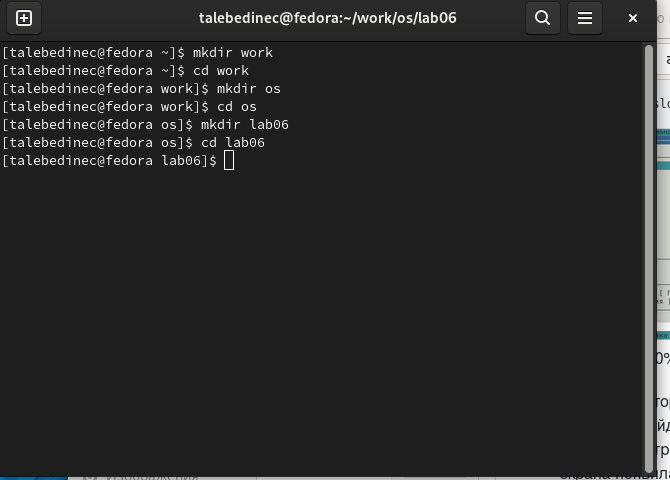
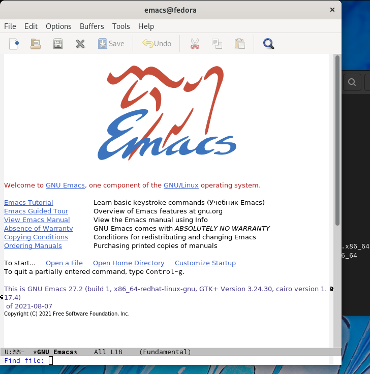
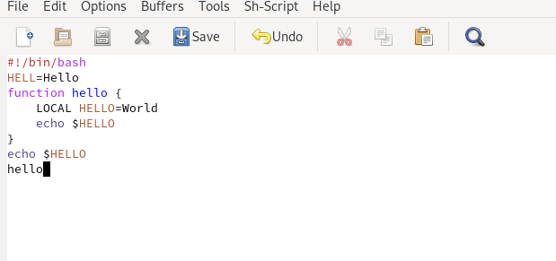
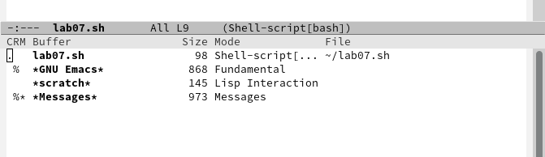
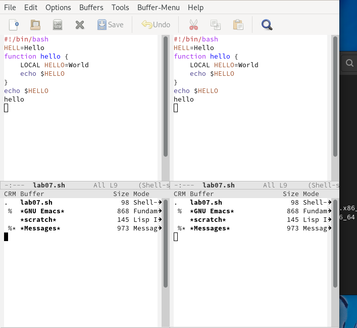

---
## Front matter
lang: ru-RU
title: /Отчет по лр №5
author: /Татьяна Лебединец НПМбд-02-21
institute: |
	\inst{1}RUDN University, Moscow, Russian Federation
	
date: NEC--2019, 30 September -- 4 October, 2019 Budva, Montenegro

## Formatting
toc: false
slide_level: 2
theme: metropolis
header-includes: 
# - \metroset{progressbar=frametitle,sectionpage=progressbar,numbering=fraction}
 - '\makeatletter'
# - '\beamer@ignorenonframefalse'
 - '\makeatother'
aspectratio: 43
section-titles: true
---

# Ход работы

    ***1.***
    Скачиваем emacs (рис. -@fig:001)
    
 {#fig:001 width=70%}

    ***2.***
     Запускаем emacs (рис. -@fig:002)

 {#fig:002 width=70%}

    ***3.***
     Вводим необходимый текст и с помощью горячих клавиш меняем его (рис. -@fig:003)
     
 {#fig:003 width=70%} 
     
    ***4.***
     Открываем буфер (рис. -@fig:004)
     
 {#fig:004 width=70%}

    ***5.***
     Меняем разметку окна (рис. -@fig:005)

 {#fig:005 width=70%}

    

# Выводы

Я познакомилась с операционной системой Linux и получила практические навыки работы с редактором emacs.

   

## {.standout}

