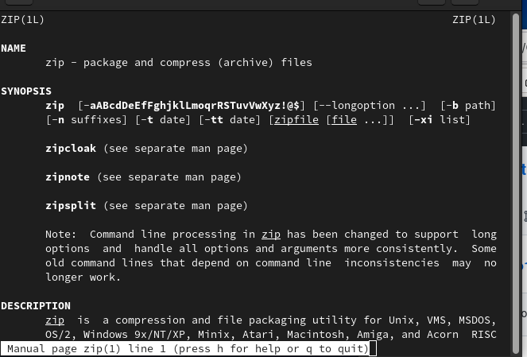
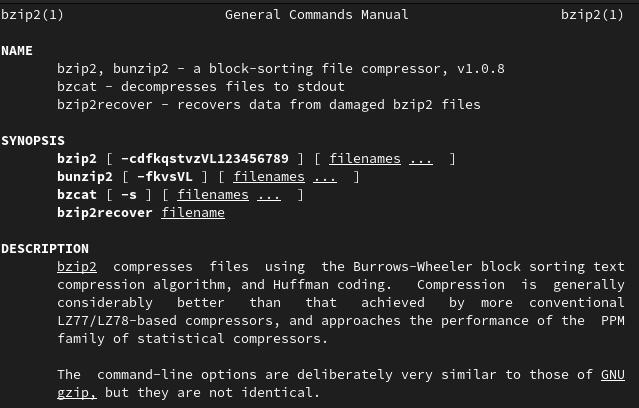
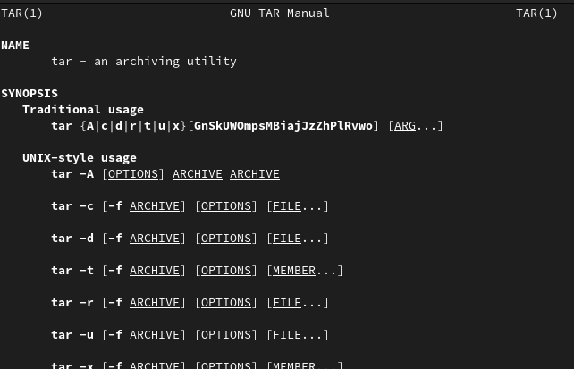
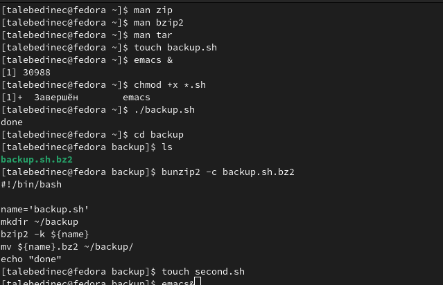
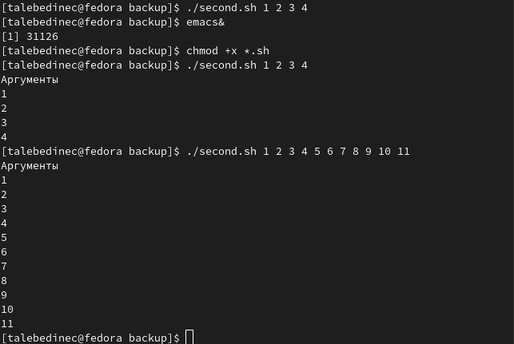
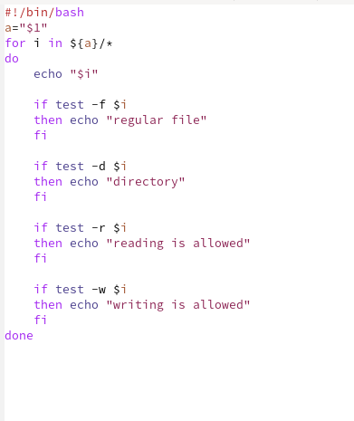
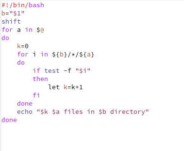
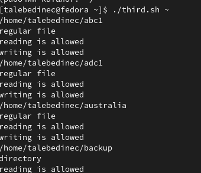
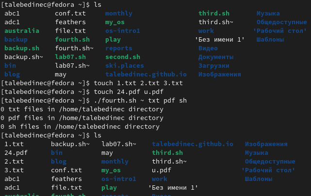

---
## Front matter
lang: ru-RU
title: /Отчет по лр №5
author: /Татьяна Лебединец НПМбд-02-21
institute: |
	\inst{1}RUDN University, Moscow, Russian Federation
	
date: NEC--2019, 30 September -- 4 October, 2019 Budva, Montenegro

## Formatting
toc: false
slide_level: 2
theme: metropolis
header-includes: 
# - \metroset{progressbar=frametitle,sectionpage=progressbar,numbering=fraction}
 - '\makeatletter'
# - '\beamer@ignorenonframefalse'
 - '\makeatother'
aspectratio: 43
section-titles: true
---

# Ход работы

## ***Шаг 1***

       ***1.***
    С помощью команды man открываем справку о командах. (рис. -@fig:001)
    
     {#fig:001 width=70%}
    
 (рис. -@fig:002) (рис. -@fig:003)

 {#fig:002 width=70%}

 {#fig:003 width=70%}

    ***2.***
     Выполняем 2 шаг из л.р. (рис. -@fig:004)

 {#fig:004 width=70%}

    ***3.***
     Проверяем работу скрипта (рис. -@fig:005)
     
 {#fig:004 width=70%} 
     
    ***4.***
     Скрипты файлов (рис. -@fig:006) (рис. -@fig:008)
     
 {#fig:006 width=70%}

 {#fig:008 width=70%}

    ***5.***
     Проверка работы 3 файла (рис. -@fig:007)

 {#fig:007 width=70%}

    ***6.*** Выполняем последний этап. (рис. -@fig:009)

 {#fig:009 width=70%} 

## {.standout}

