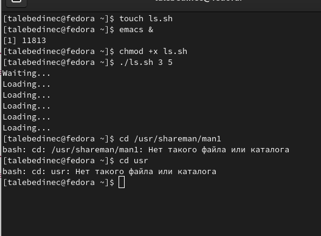
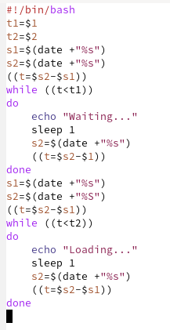

---
## Front matter
lang: ru-RU
title: /Отчет по лр №5
author: /Татьяна Лебединец НПМбд-02-21
institute: |
	\inst{1}RUDN University, Moscow, Russian Federation
	
date: NEC--2019, 30 September -- 4 October, 2019 Budva, Montenegro

## Formatting
toc: false
slide_level: 2
theme: metropolis
header-includes: 
# - \metroset{progressbar=frametitle,sectionpage=progressbar,numbering=fraction}
 - '\makeatletter'
# - '\beamer@ignorenonframefalse'
 - '\makeatother'
aspectratio: 43
section-titles: true
---

# Ход работы

## ***Шаг 1***

          ***1.***
    Создаем файл 1s.sh и пишем соответствующий скрипт. (рис. -@fig:001)
    
     {#fig:001 width=70%}
    
 Проверяем работу написанного скрипта(рис. -@fig:002)
 
 {#fig:002 width=70%}

После этого изменяем скрипт так, чтобы его можно было выполнять в нескольких терминалах и проверила его работу (команда «./1s.sh 2 5 Ожидание > /dev/pts/2 &» и команда «./1s.sh 2 5 Ожидание > /dev/tty2 »). При этом ни одна из команд не сработала, выводя сообщение "Отказано в доступе". При этом скрипт работает корректно.

    ***2.***
     К сожалению, у меня нет каталога, указанного в лр, поэтому 2 пункт задания у меня выполнить не вышло.  

## {.standout}

