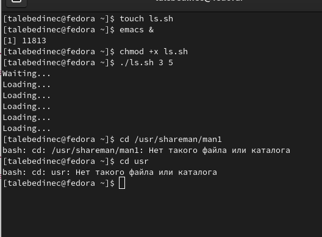
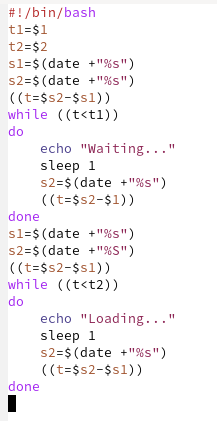

---
## Front matter
title: "Отчёт по лабораторной работе №10"
subtitle: "Дисциплина: Операционные системы"
author: "Татьяна Александровна Лебединец"

## Generic otions
lang: ru-RU
toc-title: "Содержание"

## Bibliography
bibliography: bib/cite.bib
csl: pandoc/csl/gost-r-7-0-5-2008-numeric.csl

## Pdf output format
toc: true # Table of contents
toc-depth: 2
lof: true # List of figures
lot: true # List of tables
fontsize: 12pt
linestretch: 1.5
papersize: a4
documentclass: scrreprt
## I18n polyglossia
polyglossia-lang:
  name: russian
  options:
	- spelling=modern
	- babelshorthands=true
polyglossia-otherlangs:
  name: english
## I18n babel
babel-lang: russian
babel-otherlangs: english
## Fonts
mainfont: PT Serif
romanfont: PT Serif
sansfont: PT Sans
monofont: PT Mono
mainfontoptions: Ligatures=TeX
romanfontoptions: Ligatures=TeX
sansfontoptions: Ligatures=TeX,Scale=MatchLowercase
monofontoptions: Scale=MatchLowercase,Scale=0.9
## Biblatex
biblatex: true
biblio-style: "gost-numeric"
biblatexoptions:
  - parentracker=true
  - backend=biber
  - hyperref=auto
  - language=auto
  - autolang=other*
  - citestyle=gost-numeric
## Pandoc-crossref LaTeX customization
figureTitle: "Рис."
tableTitle: "Таблица"
listingTitle: "Листинг"
lofTitle: "Список иллюстраций"
lotTitle: "Список таблиц"
lolTitle: "Листинги"
## Misc options
indent: true
header-includes:
  - \usepackage{indentfirst}
  - \usepackage{float} # keep figures where there are in the text
  - \floatplacement{figure}{H} # keep figures where there are in the text
---

# Цель работы

Познакомиться с операционной системой Linux. Изучить основы программирования в оболочке ОС UNIX. Научиться писать более сложные командные файлы с использованием логических управляющих конструкций и циклов.

# Выполнение лабораторной работы

# Задание1

    ***1.***
    Создаем файл 1s.sh и пишем соответствующий скрипт. (рис. -@fig:001)
    
     {#fig:001 width=70%}
    
 Проверяем работу написанного скрипта(рис. -@fig:002)
 
 {#fig:002 width=70%}

После этого изменяем скрипт так, чтобы его можно было выполнять в нескольких терминалах и проверила его работу (команда «./1s.sh 2 5 Ожидание > /dev/pts/2 &» и команда «./1s.sh 2 5 Ожидание > /dev/tty2 »). При этом ни одна из команд не сработала, выводя сообщение "Отказано в доступе". При этом скрипт работает корректно.

    ***2.***
     К сожалению, у меня нет каталога, указанного в лр, поэтому 2 пункт задания у меня выполнить не вышло.  

# Выводы

Я познакомилась с операционной системой Linux.

#Контрольные вопросы

    

# Список литературы{.unnumbered}

::: {#refs}
:::
