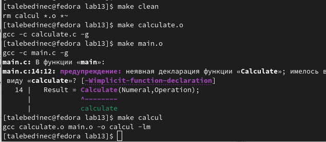

---
## Front matter
lang: ru-RU
title: /Отчет по лр №5
author: /Татьяна Лебединец НПМбд-02-21
institute: |
	\inst{1}RUDN University, Moscow, Russian Federation
	
date: NEC--2019, 30 September -- 4 October, 2019 Budva, Montenegro

## Formatting
toc: false
slide_level: 2
theme: metropolis
header-includes: 
# - \metroset{progressbar=frametitle,sectionpage=progressbar,numbering=fraction}
 - '\makeatletter'
# - '\beamer@ignorenonframefalse'
 - '\makeatother'
aspectratio: 43
section-titles: true
---

# Ход работы

# Цель работы

Приобрести простейшие навыки разработки, анализа, тестирования и отладки приложений в ОС типа UNIX/Linux на примере создания на языке программирования С калькулятора с простейшими функциями.

# Задание

1.    В домашнем каталоге создайте подкаталог ~/work/os/lab_prog.
2.    Создайте в нём файлы: calculate.h, calculate.c, main.c. Это будет примитивнейший калькулятор, способный складывать, вычитать, умножать и делить, возводить число в степень, брать квадратный корень, вычислять sin, cos, tan. При запуске он будет запрашивать первое число, операцию, второе число. После этого программа выведет результат и остановится.
3.    Выполните компиляцию программы посредством gcc:
    gcc -c calculate.c
    gcc -c main.c
    gcc calculate.o main.o -o calcul -lm
4.    При необходимости исправьте синтаксические ошибки.
5.    Создайте Makefile. Поясните в отчёте его содержание.
6.    С помощью gdb выполните отладку программы calcul (перед использованием gdb исправьте Makefile ):

*    Запустите отладчик GDB, загрузив в него программу для отладки
*    Для запуска программы внутри отладчика введите команду run
*    Для постраничного (по 10 строк) просмотра исходного код используйте команду list
*    Для просмотра строк с 12 по 15 основного файла используйте list с параметрами
*    Для просмотра определённых строк не основного файла используйте list с параметрами
*    Установите точку останова в файле calculate.c на строке номер 21
*    Выведите информацию об имеющихся в проекте точка останова
*    Запустите программу внутри отладчика и убедитесь, что программа остановится в момент прохождения точки останова
*    Отладчик выдаст информацию, а команда backtrace покажет весь стек вызываемых функций от начала программы до текущего места
*    Посмотрите, чему равно на этом этапе значение переменной Numeral. На экран должно быть выведено число 5
*    Сравните с результатом вывода на экран после использования команды
*    Уберите точки останова

7.    С помощью утилиты splint попробуйте проанализировать коды файлов calculate.c и main.c.

# Выполнение лабораторной работы

***1***    В домашнем каталоге создаю подкаталог calculate с помощью команды «mkdir calculate».

***2***    Создаю в каталоге файлы: calculate.h, calculate.c, main.c, используя команды «cd calculate» и «touch calculate.h calculate.c main.c» (рис. -@fig:001).

 {#fig:001 width=70%}

Это будет примитивнейший калькулятор, способный складывать, вычитать, умножать и делить, возводить число в степень, брать квадратный корень, вычислять sin, cos, tan. При запуске он будет запрашивать первое число, операцию, второе число. После этого программа выведет результат и остановится.
Открыв редактор Emacs, приступил к редактированию созданных файлов.
(рис. -@fig:004) (рис. -@fig:003). Интерфейсный файл calculate.h (рис. -@fig:002).

 {#fig:003 width=70%}

 {#fig:004 width=70%}

 {#fig:002 width=70%}

Основной файл main.c, реализующий интерфейс пользователя к калькулятору (рис. -@fig:005).

 {#fig:005 width=70%}

    Выполнила компиляцию программы посредством gcc, используя команды «gcc -c calculate.c», «gcc -c main.c» и «gcc calculate.o main.o -o calcul -lm» (рис. -@fig:007).

 {#fig:007 width=70%}

***4***    В ходе компиляции программы никаких ошибок выявлено не было.

***5***    Создала Makefile с необходимым содержанием (рис. -@fig:006). Данный файл необходим для автоматической компиляции файлов calculate.c (цель calculate.o), main.c (цель main.o), а также их объединения в один исполняемый файл calcul (цель calcul). Цель clean нужна для автоматического удаления файлов. Переменная CC отвечает за утилиту для компиляции. Переменная CFLAGS отвечает за опции в данной утилите. Переменная LIBS отвечает за опции для объединения объектных файлов в один исполняемый файл.

 {#fig:006 width=70%}

***6***    Далее исправила Makefile. В переменную CFLAGS добавила опцию -g, необходимую для компиляции объектных файлов и их использования в программе отладчика GDB. Сделала так, что утилита компиляции выбирается с помощью переменной CC.

После этого я удалила исполняемые и объектные файлы из каталога с помощью команды «make clean». Выполнила компиляцию файлов, используя команды «make calculate.o», «make main.o», «male calcul» (рис. -@fig:008).

 {#fig:008 width=70%}

Далее с помощью gdb выполнила отладку программы calcul. Запустила отладчик GDB, загрузив в него программу для отладки, используя команду: «gdb ./calcul» (рис. -@fig:009).

 {#fig:009 width=70%}

Для запуска программы внутри отладчика ввела команду «run» (рис. -@fig:010).

 {#fig:010 width=70%}

Для постраничного (по 10 строк) просмотра исходного кода использовала команду «list».

Для просмотра строк с 12 по 15 основного файла использовала команду «list 12,15».

Для просмотра определённых строк не основного файла использовала команду «list calculate.c:20,29».

Установила точку останова в файле calculate.c на строке номер 18, используя команды «list calculate.c:15,22» и «break 18».

Вывела информацию об имеющихся в проекте точках останова с помощью команды «info breakpoints».

Запустила программу внутри отладчика и убедилась, что программа остановилась в момент прохождения точки останова. Использовал команды «run», «5», «−» и «backtrace».

Посмотрела, чему равно на этом этапе значение переменной Numeral, введя команду «print Numeral».

Сравнила с результатом вывода на экран после использования команды «display Numeral». Значения совпадают.

Убрала точку останова с помощью команд «info breakpoints» и «delete 3».

    С помощью утилиты splint проанализировала коды файлов calculate.c и main.c. Воспользовалась командами «splint calculate.c» и «splint main.c» (рис. -@fig:011).
     {#fig:011 width=70%}
    C помощью утилиты splint выяснилось, что в файлах calculate.c и main.c присутствует функция чтения scanf, возвращающая целое число (тип int), но эти числа не используются и нигде не сохранятся. Утилита вывела предупреждение о том, что в файле calculate.c происходит сравнение вещественного числа с нулем. Также возвращаемые значения (тип double) в функциях pow, sqrt, sin, cos и tan записываются в переменную типа float, что свидетельствует о потери данных.

Проанализировала код файла calculate.c. Проанализировала код файла main.c.

## {.standout}

