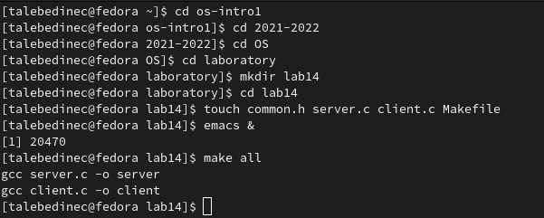
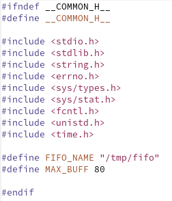
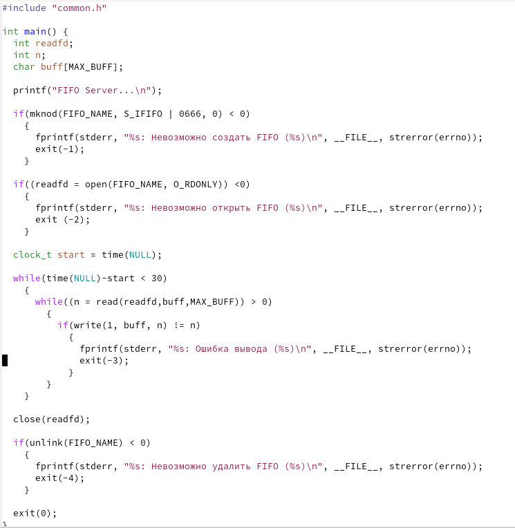
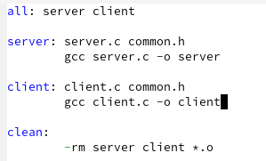
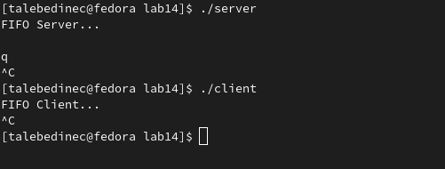

---
## Front matter
lang: ru-RU
title: /Отчет по лр №5
author: /Татьяна Лебединец НПМбд-02-21
institute: |
	\inst{1}RUDN University, Moscow, Russian Federation
	
date: NEC--2019, 30 September -- 4 October, 2019 Budva, Montenegro

## Formatting
toc: false
slide_level: 2
theme: metropolis
header-includes: 
# - \metroset{progressbar=frametitle,sectionpage=progressbar,numbering=fraction}
 - '\makeatletter'
# - '\beamer@ignorenonframefalse'
 - '\makeatother'
aspectratio: 43
section-titles: true
---

# Ход работы

## ***Шаг 1***

   #Цель работы

Приобретение практических навыков работы с именованными каналами.

#Задание

Изучите приведённые в тексте программы server.c и client.c. Взяв данные примеры за образец, напишите аналогичные программы, внеся следующие изменения:

1. Работает не 1 клиент, а несколько (например, два).
2. Клиенты передают текущее время с некоторой периодичностью (например, раз в пять секунд). Используйте функцию sleep() для приостановки работы клиента.
3. Сервер работает не бесконечно, а прекращает работу через некоторое время (например, 30 сек). Используйте функцию clock() для определения времени работы сервера. Что будет в случае, если сервер завершит работу, не закрыв канал?

#Ход работы

    ***1.***
    Для начала я создала необходимые файлы с помощью команды «touch common.h server.c client.c Makefile»и открыла редактор emacs для их редактирования. Все комнады, написанные в консоле ниже (рис. -@fig:001) 
    
     {#fig:001 width=70%}
    
 ***2*** 
 Далее я изменила коды программ, представленных в тексте лабораторной работы.
В файл common.h добавила стандартные заголовочные файлы unistd.h и time.h, необходимые для работы кодов других файлов. Common.h предназначен для заголовочных файлов, чтобы в остальных программах их не прописывать каждый раз (рис. -@fig:005).
 
 {#fig:005 width=70%}

***3***
В файл server.c добавила цикл while для контроля за временем работы сервера. Разница между текущим временем time(NULL) и временем начала работы clock_t start=time(NULL) (инициализация до цикла) не должна превышать 30 секунд (рис. -@fig:004).

 {#fig:004 width=70%}

***4***
Makefile (файл для сборки) не изменяла (рис. -@fig:003).

 {#fig:004 width=70%}

***5***

Далее я проверила работу написанного кода. (рис. -@fig:002).

 {#fig:002 width=70%}

## {.standout}

