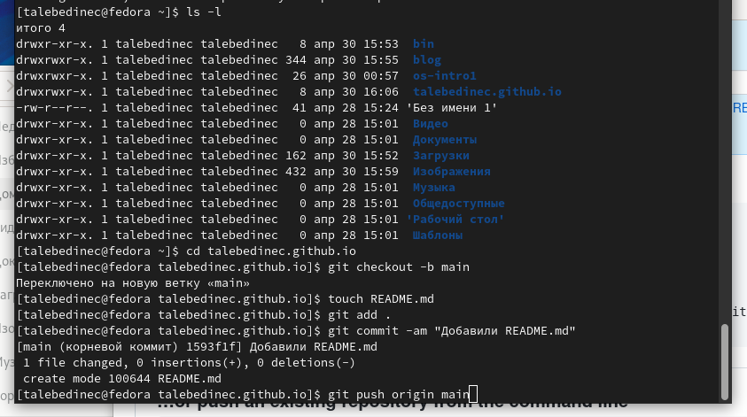

---
## Front matter
title: "Отчёт по первому этапу индивидуального проекта"
subtitle: "Дисциплина: Операционные системы"
author: "Татьяна Александровна Лебединец"

## Generic otions
lang: ru-RU
toc-title: "Содержание"

## Bibliography
bibliography: bib/cite.bib
csl: pandoc/csl/gost-r-7-0-5-2008-numeric.csl

## Pdf output format
toc: true # Table of contents
toc-depth: 2
lof: true # List of figures
lot: true # List of tables
fontsize: 12pt
linestretch: 1.5
papersize: a4
documentclass: scrreprt
## I18n polyglossia
polyglossia-lang:
  name: russian
  options:
	- spelling=modern
	- babelshorthands=true
polyglossia-otherlangs:
  name: english
## I18n babel
babel-lang: russian
babel-otherlangs: english
## Fonts
mainfont: PT Serif
romanfont: PT Serif
sansfont: PT Sans
monofont: PT Mono
mainfontoptions: Ligatures=TeX
romanfontoptions: Ligatures=TeX
sansfontoptions: Ligatures=TeX,Scale=MatchLowercase
monofontoptions: Scale=MatchLowercase,Scale=0.9
## Biblatex
biblatex: true
biblio-style: "gost-numeric"
biblatexoptions:
  - parentracker=true
  - backend=biber
  - hyperref=auto
  - language=auto
  - autolang=other*
  - citestyle=gost-numeric
## Pandoc-crossref LaTeX customization
figureTitle: "Рис."
tableTitle: "Таблица"
listingTitle: "Листинг"
lofTitle: "Список иллюстраций"
lotTitle: "Список таблиц"
lolTitle: "Листинги"
## Misc options
indent: true
header-includes:
  - \usepackage{indentfirst}
  - \usepackage{float} # keep figures where there are in the text
  - \floatplacement{figure}{H} # keep figures where there are in the text
---

# Цель работы

Создать статический сайт на базе HUGO.

# Задание

На первом этапе нам необходимо установить необходимое ПО, скачать шаблон темы сайта, разместить егог на хостинге, установить параметр для URLs сайта и разместить заготовку сайта на GitHub pages.

# Выполнение лабораторной работы

***Шаг 1***
Устанавливаем необходимое ПО с помощью команды sudo dnf install go hugo (рис. [@fig:001])
 {#fig:001 width=70%}

(рис. [@fig:015])

 {#fig:015 width=70%}

(рис. [@fig:017])

 {#fig:017 width=70%}

***Шаг 2*** 
Клонируем папку blog в нашу домашнюю папку из хостинга гитхаб (рис. [@fig:002])

 {#fig:002 width=70%}

***Шаг 3***
С помощью команды ~/bin/hugo server генерируем шаблон нашего будущего сайта(рис. [@fig:003])

 {#fig:003 width=70%}

(рис. [@fig:004])

 {#fig:004 width=70%}

***Шаг 4***
Создаем пустой репозиторий и копируем его в терминал (рис. [@fig:005]) (рис. [@fig:006])

 {#fig:005 width=70%}

 {#fig:006 width=70%}

***Шаг 5*** 
Добавляем новый файл README.md (рис. [@fig:007]) (рис. [@fig:008])

 {#fig:007 width=70%}

 {#fig:008 width=70%}

***Шаг 6***
Клонируем все папки из каталога blog на хостинг (рис. [@fig:009])

 {#fig:009 width=70%}

(рис. [@fig:010])

 {#fig:010 width=70%}

***Шаг 7***
шаблон сайта уже с нашим адресом (рис. [@fig:013])

 {#fig:013 width=70%}

# Выводы

Мы выполнили первый этап индивидуального проекта.

# Список литературы{.unnumbered}

::: {#refs}
:::
